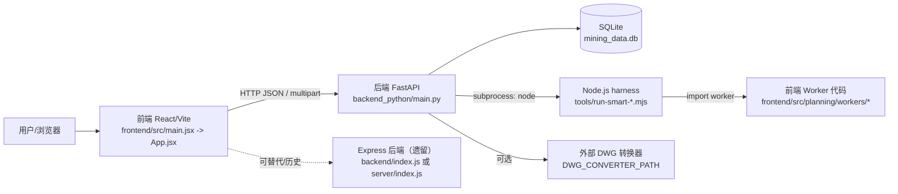
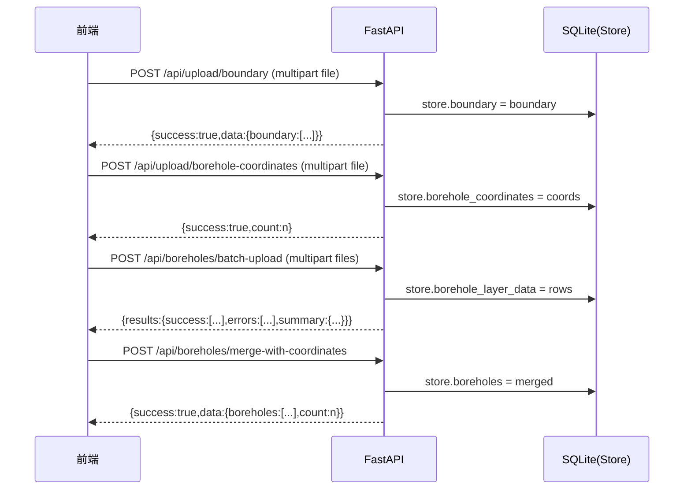
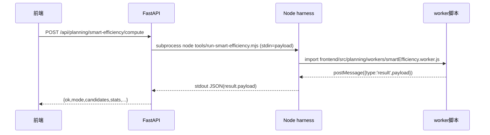
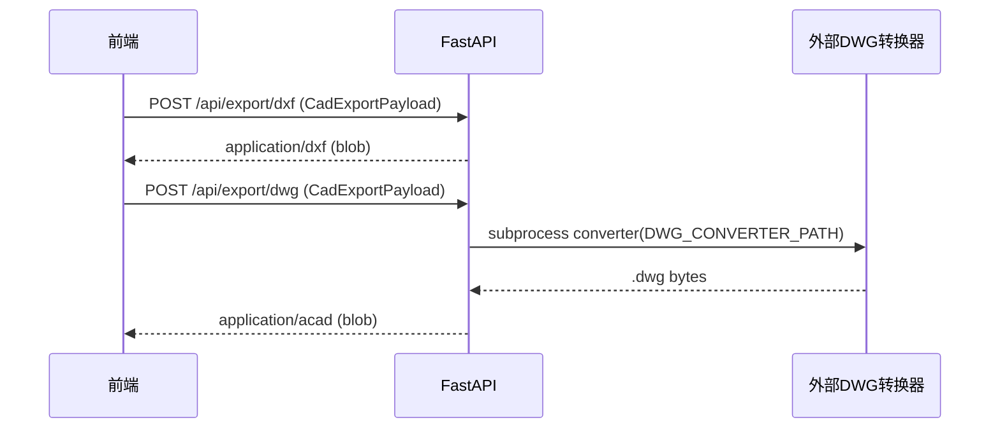

# 系统功能板块与实现原理说明书

## 目录
- [0. 版本与范围](#0-版本与范围)
- [1. 系统概览](#1-系统概览)
- [2. 功能板块清单（全量）](#2-功能板块清单全量)
- [3. 模块级实现原理](#3-模块级实现原理)
  - [3.1 数据与工程管理](#31-数据与工程管理)
  - [3.2 数据导入（CSV/批量）](#32-数据导入csv批量)
  - [3.3 基础空间数据（边界/钻孔）](#33-基础空间数据边界钻孔)
  - [3.4 地质建模与参数分析（插值/分层）](#34-地质建模与参数分析插值分层)
  - [3.5 GNN 地质建模（图方法预测）](#35-gnn-地质建模图方法预测)
  - [3.6 覆岩扰动 ODI 与协同调控（前端为主）](#36-覆岩扰动-odi-与协同调控前端为主)
  - [3.7 智能规划（Smart Efficiency/Resource/Weighted）](#37-智能规划smart-efficiencyresourceweighted)
  - [3.8 采矿设计方案（工作面/巷道/规程/校验）](#38-采矿设计方案工作面巷道规程校验)
  - [3.9 CAD 导出（DXF/DWG）](#39-cad-导出dxfdwg)
  - [3.10 采掘接续（阶段1前端排程 + 后端RL可选）](#310-采掘接续阶段1前端排程--后端rl可选)
  - [3.11 工程经济分析（现金流/NPV/风险联动）](#311-工程经济分析现金流npv风险联动)
- [4. 系统级架构与数据流](#4-系统级架构与数据流)
  - [4.1 组件架构图（Mermaid）](#41-组件架构图mermaid)
  - [4.2 关键流程时序图（Mermaid）](#42-关键流程时序图mermaid)
- [5. 工程审计与改进建议](#5-工程审计与改进建议)
- [6. 待补充信息清单](#6-待补充信息清单)

---

## 0. 版本与范围
- 仓库/分支：`mining-plan` / `main`
- 扫描时间：2026-01-30
- 代码版本：`5ff6f9a2f13bd05007acb3f121d23a52e4eaf557`
- 启动方式（开发）：
  - 前端：Vite dev server（默认 5173）
  - 后端：FastAPI + Uvicorn（默认 3001）
  - 说明：仓库同时保留 Node/Express 后端（`backend/` 与 `server/`），但启动指南推荐 Python 后端。
- 主要技术栈：
  - 前端：React 18 + Vite 5 + TailwindCSS；可视化：Recharts；几何/图算法：`d3-delaunay`、`jsts`、`three`
  - 后端（推荐）：Python FastAPI；几何/插值/图：Shapely、SciPy、NumPy、Pandas、NetworkX
  - 后端（遗留）：Node.js + Express（CSV 上传、评分、设计方案等旧实现）
- 扫描范围说明：本说明书以 `frontend/` 与 `backend_python/` 为主线；同时标注 `backend/`、`server/` 的重复实现与风险。

### 0.1 开发启动（推荐）
1) VS Code 打开工作区后会自动启动（folderOpen）：
  - 前端任务：“前端：开发服务器（自动热更新）”，调用 `mining-plan/tools/start-frontend.ps1 -Port 5173`
  - 后端任务：“后端：FastAPI（自动热更新）”，调用 `backend_python/.venv/Scripts/python.exe -m uvicorn main:app --host 0.0.0.0 --port 3001 --reload`
2) 手动启动（等价）：
  - 前端：在 `mining-plan/frontend` 下执行 `npm run dev`（Vite 5173）
  - 后端：在 `mining-plan/backend_python` 下执行 `python -m uvicorn main:app --host 0.0.0.0 --port 3001 --reload`
3) 构建与“单端口访问”（可选）：
  - 执行前端 `npm run build` 生成 `frontend/dist`；FastAPI 检测到该目录后会 `app.mount('/')` 静态托管（仍使用 3001）。

证据锚点：
- VS Code 任务定义：..\ .vscode/tasks.json：`label: 前端：开发服务器（自动热更新）` / `label: 后端：FastAPI（自动热更新）`
- 前端启动脚本：tools/start-frontend.ps1：端口占用检测与 `npm run dev -- --host 0.0.0.0 --port $Port --strictPort`
- FastAPI 静态站点挂载：backend_python/main.py：`if dist_dir.exists(): app.mount('/', StaticFiles(...))`

### 0.2 环境变量与配置
> 约定：前端 `.env` 变量以 `VITE_` 前缀注入；后端从系统环境读取。

前端（Vite）：
- `VITE_API_BASE`：完整 API base（例如 `http://10.4.81.4:3001/api`）
- `VITE_API_HOST` / `VITE_API_PORT`：仅覆盖 host/port（默认 port=3001）

后端（FastAPI/Python）：
- `ALLOWED_ORIGINS` / `ALLOWED_ORIGIN_REGEX`：CORS 白名单（开发/局域网访问用）
- `MINING_DB_PATH`：SQLite 路径（默认 `mining_data.db`）
- `DWG_CONVERTER_PATH` / `DWG_CONVERTER_MODE` / `DWG_CONVERTER_TIMEOUT_S` / `DWG_CONVERTER_ODA_*`：DWG 转换器配置
- `MP_WORKER_WAIT_MS`：Node harness 等待 worker 输出稳定的超时控制（默认 8000ms）

证据锚点：
- API_BASE 计算与 env 支持：frontend/src/api.js：`VITE_API_BASE` / `VITE_API_HOST` / `VITE_API_PORT` / `API_BASE`
- CORS env：backend_python/main.py：`ALLOWED_ORIGINS` / `ALLOWED_ORIGIN_REGEX`
- DB env：backend_python/store.py：`MINING_DB_PATH`
- DWG env：backend_python/routers/export_cad.py：`DWG_CONVERTER_PATH` 等
- Worker 等待 env：tools/run-smart-efficiency.mjs / tools/run-smart-resource.mjs：`MP_WORKER_WAIT_MS`

证据锚点：
- 根脚本：package.json：`scripts.dev:frontend` / `scripts.dev:backend` / `scripts.build:frontend`
- 启动指南：启动指南.md：`系统后端已重构为 Python (FastAPI)`
- FastAPI 入口：backend_python/main.py：`app = FastAPI(...)`、`app.include_router(...)`
- Express 入口（遗留）：backend/index.js：`app.use('/api/...', ...)`

---

## 1. 系统概览
- 系统定位：面向采矿工程的“数据导入 → 地质/扰动分析 → 智能规划/设计 → 接续排程 → 经济评价 → CAD导出”的交互式原型/工具链。
- 核心业务闭环（可确认链路）：
  1) CSV 导入边界/钻孔/分层 → 2) 生成参数场（地质/ODI/风险）→ 3) 智能规划候选（效率/回收/扰动/多目标）→ 4) 选方案并导出 DXF/DWG → 5) 采掘接续排程（阶段1）→ 6) 工程经济分析（现金流/NPV/回收期）。
- 关键模块：
  - 数据与工程：SQLite 持久化 Store（Python 侧）
  - 导入：多 CSV 类型识别与归一化
  - 地质：分层解析 + 煤厚插值（SciPy griddata）
  - GNN 地质：KDTree + 反距离权重的“图思想”预测（不依赖 PyTorch）
  - 智能规划：Smart Efficiency / Smart Resource / Smart Weighted（Python 后端通过 Node harness 复用前端 worker 保持口径）
  - 设计：工作面布局 + 巷道生成 + 规程校验 + DXF 导出
  - 接续：前端确定性排程 +（可选）后端强化学习训练/优化
  - 经济：基于排程月产量 + 风险月序列 → 现金流/NPV
- 外部依赖：
  - 必需：Node.js（用于前端构建 + Python 规划模块的 Node harness 执行）
  - 可选：DWG 转换器（外部可执行程序，由环境变量配置）
  - 存储：本地 SQLite 文件（默认 `mining_data.db`），不依赖外部数据库

证据锚点：
- SQLite Store：backend_python/store.py：`DB_PATH = os.getenv("MINING_DB_PATH", "mining_data.db")`、`Store.clear()`
- 智能规划 Node harness：backend_python/routers/planning.py：`_run_node_smart_efficiency` / `_run_node_smart_resource`
- Node harness 脚本：tools/run-smart-efficiency.mjs：`import('../frontend/src/planning/workers/smartEfficiency.worker.js')`
- DWG 转换器：backend_python/routers/export_cad.py：`DWG_CONVERTER_PATH` / `DWG_CONVERTER_TIMEOUT_S`

---

## 2. 功能板块清单（全量）
> 说明：前端当前为“单页多视图”形态（`App.jsx` 内通过 `mainViewMode` 切换），并存在一套较早的 `MiningDesignSystem.jsx`（Canvas 方案）代码路径。

| 一级模块 | 二级页面/子模块 | 核心能力点 | 证据锚点 |
|---|---|---|---|
| 系统入口与运行 | 前端入口 | React 挂载、错误边界 | frontend/src/main.jsx：`createRoot(...).render(...)` |
| 系统入口与运行 | 后端入口（FastAPI） | 路由注册、CORS、静态站点挂载 | backend_python/main.py：`app.include_router(...)`、`CORSMiddleware` |
| 系统入口与运行 | 后端入口（Express/遗留） | boundary/boreholes/score/design/upload/geology | backend/index.js：`app.use('/api/...')` |
| 工程与数据 | 项目管理 | 获取项目信息、清空数据、归一化坐标偏移 | backend_python/main.py：`/api/project`、`/api/project/clear`；backend_python/store.py：`get_normalized_boundary()` |
| 数据导入 | CSV 上传（边界） | CSV 解析→列归一化→闭合边界→写入 Store | backend_python/routers/upload.py：`@router.post('/boundary')` |
| 数据导入 | CSV 上传（钻孔坐标） | CSV 解析→列归一化→写入 Store | backend_python/routers/upload.py：`@router.post('/borehole-coordinates')` |
| 数据导入 | 分层批量上传 | 多文件读取→聚合→写入 borehole_layer_data | backend_python/routers/boreholes.py：`@router.post('/batch-upload')` |
| 数据导入 | 坐标与分层合并 | join/聚合→字段映射→生成 boreholes | backend_python/routers/boreholes.py：`merge-with-coordinates` |
| 基础数据 | 边界查询 | 返回归一化边界 | backend_python/routers/boundary.py：`get_boundary()` |
| 基础数据 | 钻孔查询 | 返回归一化钻孔列表 | backend_python/routers/boreholes.py：`get_boreholes()` |
| 地质建模 | 分层提取 | 从分层表按孔组装层序列 | backend_python/routers/geology.py：`get_borehole_layers()` |
| 地质建模 | 煤厚插值模型 | SciPy `griddata` 生成网格 | backend_python/routers/geology.py：`generate_geology()` |
| GNN地质 | 训练/预测 | KDTree 邻域 + 反距离加权 | backend_python/routers/gnn_geology.py：`GraphBasedGeologyPredictor` |
| 评分 | 评分网格 | 当前为占位：随机网格 + 存储 | backend_python/routers/score.py：`np.random.randint(...)` |
| 智能规划 | smart-efficiency | 后端复用前端 worker（Node harness） | backend_python/routers/planning.py：`@router.post('/planning/smart-efficiency/compute')` |
| 智能规划 | smart-resource | 后端复用前端 worker（Node harness） | backend_python/routers/planning.py：`@router.post('/planning/smart-resource/compute')` |
| 智能规划 | smart-weighted | 三目标候选池 + NSGA-II 选择 | backend_python/routers/planning.py：`smart_weighted_compute()` 注释描述 |
| 智能规划 | L2 几何对比 | Shapely union/symdiff/bbox/centroid 阈值判定 | backend_python/routers/planning.py：`l2_compare()`/`_compare_geoms()` |
| 智能规划 | 吨位排序 | 对候选采出形状做网格采样算吨位并排序 | backend_python/routers/planning.py：`SmartResourceTonnageRequest/Response` |
| 设计方案 | 生成设计 | 工作面布局 + 巷道生成 + 规程约束 | backend_python/routers/design.py：`generate_smart_layout()` / `MiningRules` |
| 设计方案 | 规程校验 | 对工作面长度/推进等约束进行验证 | backend_python/routers/design.py：`@router.post('/validate')` |
| 设计方案 | DXF 导出（设计模块） | ezdxf 绘图、图层规范 | backend_python/routers/design.py：`@router.get('/export/dxf')` |
| CAD 导出 | DXF/DWG 导出（视图导出） | 前端提交几何+变换→后端生成 DXF；DWG 需外部转换器 | backend_python/routers/export_cad.py：`@router.post('/dxf')`、`@router.post('/dwg')` |
| 协同调控 | ODI* 统一标尺 | 前端对风险/参数做统一口径与门禁（代码集中在 App.jsx） | frontend/src/App.jsx：`mainViewMode === 'cocontrol'`（视图切换） |
| 采掘接续 | 阶段1排程（前端） | 基于推进/掘进/安装/搬家节拍生成任务与月产 | frontend/src/utils/successionStage1.js：`buildSuccessionStage1Plan()` |
| 采掘接续 | 后端 RL 训练/优化（可选） | PPO/A2C 训练；基线策略；详细计划 | backend_python/routers/succession.py：`@router.post('/train')`、`/optimize` |
| 经济分析 | 现金流与 NPV | 月产→收入/成本→NPV/回收期；风险联动减产 | frontend/src/utils/economics.js：`computeEconomicsFromPlan()` |

前端 API 汇总入口：frontend/src/api.js（`API_BASE`、`apiRequest`、各业务 API 函数）。

---

## 3. 模块级实现原理

### 3.1 数据与工程管理
- 业务目标：
  - 输入：导入的采区边界、钻孔坐标、钻孔属性/分层、派生结果（地质模型、评分、设计方案）。
  - 输出：可复用的“工程数据快照”（后端持久化 + 前端局部快照功能）。
- 入口与页面：
  - 后端工程：backend_python/main.py：`/api/project`、`/api/project/clear`
  - 持久化存储：backend_python/store.py：`Store`（SQLite）
  - 前端工程快照：frontend/src/App.jsx：`PROJECT_SNAPSHOT_SCHEMA = 5`（保存/导入输入快照）
- 核心数据结构（DTO/Schema）：
  - SQLite projects 表字段：boundary/boreholes/borehole_coordinates/borehole_layer_data/geology_model/scores/design_result/coord_offset
  - 证据锚点：backend_python/store.py：`CREATE TABLE IF NOT EXISTS projects (...)`
- 核心流程：
  1) 后端启动时 `init_database()` 确保默认项目存在；
  2) 各 router 写入 `store.<field>`（JSON 序列化到 SQLite）；
  3) 查询时通过 `get_normalized_*` 输出归一化坐标（必要时记录 `coord_offset`）。
- 关键接口：
  - `GET /api/project`：返回工程摘要（边界点数/钻孔数/是否有设计结果）
  - `POST /api/project/clear`：清空默认项目数据
  - 证据锚点：backend_python/main.py：`get_project_info()`、`clear_project()`
- 关键依赖：
  - `sqlite3`（Python 标准库）
- 性能与边界条件：
  - 当前为单表单项目（name='default'）模型；并发写入依赖 SQLite 锁；大型 JSON 字段可能导致 IO 放大。

### 3.2 数据导入（CSV/批量）
- 业务目标：把现场数据（边界/钻孔/分层）快速导入系统，并统一列名口径，形成可用于后续计算的数据集。
- UI/交互流程（典型）：
  - 页面（前端上传区）→ 选择/拖拽 CSV → `frontend/src/api.js` 调用上传接口 → 后端解析与入库 → 前端刷新/提示。
- 核心数据结构：
  - boundary：`[{x:number,y:number}, ...]`（闭合）
  - borehole_coordinates：`[{id,x,y}, ...]`
  - borehole_layer_data：原始行表（含 `_source_file`）
- 核心算法/规则：
  - CSV 解析：`utils.parsing.parse_csv_file`（按 bytes 解析，未在本次扫描深入）
  - 列归一化：`normalize_columns(raw_data, 'boundary'|'coordinate')`
  - 批量分层合并：按 ID 列聚合数值列均值，并映射到前端标准字段：`rockHardness/gasContent/coalThickness/groundWater`
- 关键接口：
  - `POST /api/upload/boundary`（multipart file）
  - `POST /api/upload/borehole-coordinates`（multipart file）
  - `POST /api/boreholes/batch-upload`（multipart files + Form targetCoalSeam）
  - `POST /api/boreholes/merge-with-coordinates`
  - 证据锚点：backend_python/routers/upload.py：`upload_boundary()`、`upload_coordinates()`；backend_python/routers/boreholes.py：`batch_upload_boreholes()`、`merge_data()`
- 异常与边界：
  - 缺列：返回 400 并给出检测到的列名（坐标导入）
  - 分层无 ID：回退到从文件名提取 ID 或生成 mock 数据
  - 注意：上传接口 `file.read()` 全量读入内存；大文件存在内存峰值风险。

### 3.3 基础空间数据（边界/钻孔）
- 业务目标：提供后续地质/规划/设计计算所需的基础几何与采样点。
- UI/交互流程：
  - 导入后前端通过 `getBoundary()`/`getBoreholes()` 拉取显示。
- 数据结构：
  - boundary（闭合多边形顶点序列）
  - boreholes（含 x/y + 属性字段）
- 关键接口：
  - `GET /api/boundary/`，`GET /api/boreholes/`
  - 证据锚点：backend_python/routers/boundary.py：`get_boundary()`；backend_python/routers/boreholes.py：`get_boreholes()`；frontend/src/api.js：`getBoundary()`/`getBoreholes()`
- 边界条件：
  - 坐标归一化：当边界 minX/minY 大于阈值时，会设置 `coord_offset` 并输出平移后的坐标（影响与真实坐标系对齐，导出需明确变换）。
  - 证据锚点：backend_python/store.py：`get_normalized_boundary()`、`coord_offset`

### 3.4 地质建模与参数分析（插值/分层）
- 业务目标：
  - 输入：钻孔（含煤厚）与钻孔分层表。
  - 输出：煤层厚度网格模型（用于云图）；钻孔分层序列（用于 3D/含水层识别）。
- UI/交互流程：
  - 导入分层 → `GET /api/geology/layers` → 前端在地质页面进行选择/展示/导出（CSV/PNG）。
  - 生成插值模型 → `POST /api/geology/` → `GET /api/geology/`。
- 核心数据结构：
  - layers 输出：`{ boreholes: [{id,x,y,total_depth,layers:[{name,thickness,top_depth,bottom_depth,is_coal}]}] }`
  - geology_model：`{resolution,minX,minY,maxX,maxY,data:[[...]]}`
- 核心算法/规则：
  - 分层解析：按钻孔 ID 分组，累加厚度生成 top/bottom 深度区间；缺真实分层时从钻孔煤厚生成 mock 层序
  - 插值：`scipy.interpolate.griddata(points, values, method='cubic'|'linear')`，并 `nan_to_num`
- 关键接口：
  - `GET /api/geology/layers`
  - `POST /api/geology/`（query/body：resolution）
  - `GET /api/geology/`
  - 证据锚点：backend_python/routers/geology.py：`get_borehole_layers()`、`generate_geology()`
- 性能与边界条件：
  - griddata 在点数大、resolution 高时计算量显著；当前接口未做限流/缓存。

### 3.5 GNN 地质建模（图方法预测）
- 业务目标：提供“基于空间邻域关系”的煤厚/顶底板预测能力（用于更高级三维建模或补点）。
- 核心实现：
  - 使用 KDTree 查询 k 邻居；以反距离平方作为权重，对 thickness/floor/roof 做加权平均，并输出简易置信度。
- 核心数据结构：
  - 输入 boreholes：`[{id,x,y,z?,thickness?}]`（实际从 store/boreholes 提取字段）
  - 输出：`{thickness,floor,roof,confidence}`
- 关键接口（路由文件包含 train/predict/grid 等，需结合后续补扫确认完整参数）：
  - 证据锚点：backend_python/routers/gnn_geology.py：`GraphBasedGeologyPredictor.fit()`、`predict_at()`
- 边界条件：
  - 钻孔数量 < 3 会拒绝训练；k 会取 `min(k_neighbors, n)`。

### 3.6 覆岩扰动 ODI 与协同调控（前端为主）
- 业务目标：
  - 输入：钻孔/分层/目标层识别结果、采高/步长/富裕系数等参数。
  - 输出：ODI 分布云图、不同层位/场景（surface/upward/aquifer）下的扰动评估结果；并在协同调控模式下统一 ODI* 标尺与参数门禁。
- UI/交互流程：
  - 通过顶部主视图按钮切换：综合扰动结果(ODI) / 地质 / 智能规划 / 协同调控 / 采掘接续 / 经济分析。
  - 证据锚点：frontend/src/App.jsx：`mainViewMode === 'odi'|'cocontrol'`（视图切换按钮区）
- 核心数据结构：
  - ODI 场（FieldPack 形态在规划/扰动模块中也复用）：二维网格 + bounds + 分辨率（实际字段以 App.jsx 内部状态为准）。
- 核心算法/规则（可确认采用的技术栈）：
  - 前端引入：Delaunay 三角剖分、JSTS 几何运算（buffer 等），用于插值/裁剪/形态处理。
  - 证据锚点：frontend/src/App.jsx：`import { Delaunay } from 'd3-delaunay'`、`import BufferOp from 'jsts/.../BufferOp.js'`
- 性能与边界条件：
  - App.jsx 为超大单文件（约 2.7 万行），与 worker/后端交织；复杂交互下的状态一致性依赖大量 `useState/useRef`。

### 3.7 智能规划（Smart Efficiency/Resource/Weighted）
- 业务目标：
  - 输入：采区边界、推进方向/煤柱范围、约束与权重、（可选）ODI 风险场。
  - 输出：候选采区条带组合（可采域/工作面几何）、指标（效率/回收/扰动/吨位）、候选表格与最优推荐。
- UI/交互流程（确认链路）：
  1) 前端点击“启动智能采区规划” → 触发 compute（worker 或后端）
  2) 结果返回后，前端缓存并允许选择候选 signature
  3) 回收模式会异步调用后端吨位排序，提升大数据场景性能
  - 证据锚点：frontend/src/App.jsx：`handleComputeResult(...)` 内的 `buildDisturbanceRankingPackForEfficiencyResult` 与“吨位交给后端”注释段落；frontend/src/api.js：`smartEfficiencyCompute()`/`smartResourceCompute()`/`smartWeightedComputeCancelable()`/`smartResourceTonnageSort()`
- 核心数据结构：
  - 规划结果（前端 worker 口径）：`{ ok, mode, cacheKey, candidates:[{signature, render...}], stats... }`
  - SmartResourceTonnageRequest/Response（后端）：见 planning.py Pydantic 模型
- 核心算法/规则：
  - 口径复用策略：Python 后端通过 subprocess 调用 Node.js，直接执行前端 worker 脚本，保证输出兼容（L2-first 策略）。
  - 多目标 weighted：生成多源候选（efficiency/resource/disturbance）→ 吨位/回收/扰动评分 → NSGA-II（非支配排序 + 拥挤距离）选 TopK。
  - L2 compare：Shapely 对候选几何做 union/symdiff/out-of-bound/topology diagnostics，用阈值输出 pass/warn/fail。
  - 证据锚点：backend_python/routers/planning.py：`smart_efficiency_compute()` docstring、`smart_weighted_compute()` 注释、`l2_compare()`/`_compare_geoms()`
  - Node harness：tools/run-smart-efficiency.mjs、tools/run-smart-resource.mjs
- 关键接口：
  - `POST /api/planning/smart-efficiency/compute`
  - `POST /api/planning/smart-resource/compute`
  - `POST /api/planning/smart-weighted/compute`
  - `POST /api/planning/smart-resource/tonnage`
  - `POST /api/planning/l2/compare`、`POST /api/planning/l2/compare-batch`
- 关键依赖：
  - 后端：Shapely/NumPy；Node.js；subprocess
  - 前端：worker（frontend/src/planning/workers/*）
- 性能与边界条件：
  - 后端 Node harness 有超时与缓存（内存 LRU-ish），但仍受 Node 启动/执行成本影响。
  - 证据锚点：backend_python/routers/planning.py：`_NODE_RESULT_CACHE_MAX`、`ThreadPoolExecutor(max_workers=3)`

### 3.8 采矿设计方案（工作面/巷道/规程/校验）
- 业务目标：
  - 输入：采区边界、设计参数（推进长度/煤柱/边界煤柱/倾角倾向/规程约束/人工编辑巷道）。
  - 输出：工作面布置（panels/workfaces）、巷道（roadways）、统计指标，并支持规程校验与 DXF 导出。
- UI/交互流程：
  - 前端调用 `generateDesign(options)` → 后端生成 → 前端展示/继续用于接续/经济等。
- 核心数据结构：
  - DesignParams（Pydantic）：faceWidth/pillarWidth/boundaryMargin/dipAngle/dipDirection/miningRules/userEdits/targetSeam
  - DesignResult：`{panels, roadways, stats, designParams, miningRules}`
  - 证据锚点：backend_python/routers/design.py：`class DesignParams`、`store.design_result = {...}`
- 核心算法/规则：
  - 工作面布局：`generate_smart_layout(...)`（Shapely/规则/地质分析器等，定义在 utils.algorithms）
  - 巷道生成：`generate_roadways`（在 utils.algorithms 侧）
  - 规程：`MiningRules`（默认规程 `DEFAULT_MINING_RULES`），校验工作面长度、推进长度等。
  - 证据锚点：backend_python/routers/design.py：`from utils.algorithms import generate_smart_layout, generate_roadways`、`@router.post('/validate')`
- 关键接口：
  - `POST /api/design/`
  - `GET /api/design/`
  - `GET /api/design/rules`
  - `POST /api/design/validate`
  - `GET /api/design/export/dxf`
- 异常与边界：
  - 缺边界：400
  - 导出：无设计结果 400；失败 500

### 3.9 CAD 导出（DXF/DWG）
- 业务目标：把当前“中部视图”的采区边界/工作面/有效域/标注等几何，按明确坐标变换导出为 DXF 或 DWG。
- UI/交互流程：
  - 前端构建 `CadExportPayload` → `POST {API_BASE}/export/dxf|dwg` → 下载文件。
  - 证据锚点：frontend/src/App.jsx：`exportCadViaBackend()`、`buildCadExportPayload()`
- 核心数据结构：
  - 后端 Pydantic：CadPoint/CadLoop/CadFace/CadTransform/CadExportPayload
  - 证据锚点：backend_python/routers/export_cad.py：`class CadExportPayload`
- 核心算法/规则：
  - DXF：ezdxf 写入图层/颜色/线宽；对几何做闭合/去重；错误码结构化返回。
  - DWG：先生成 DXF，再调用外部转换器（由环境变量指定）
- 关键接口：
  - `POST /api/export/dxf`
  - `POST /api/export/dwg`
- 关键依赖：
  - ezdxf
  - 外部 DWG 转换器：`DWG_CONVERTER_PATH` 等
  - 证据锚点：backend_python/routers/export_cad.py：`DWG_CONVERTER_PATH`、`_run_dxf_to_dwg_converter()`
- 性能与边界条件：
  - payload 几何过大时，序列化/写 DXF 会变慢；DWG 转换器可能超时（默认 120s）。

### 3.10 采掘接续（阶段1前端排程 + 后端RL可选）
- 业务目标：
  - 输入：工作面集合（几何→宽度/推进长度）、生产参数（采高、密度、回收率、推进/掘进速度、安装/搬家工期、队伍数等）、（可选）风险曲线。
  - 输出：阶段1排程（任务清单+月产量）；阶段3对比建议；（可选）后端 RL 训练与优化结果。
- UI/交互流程：
  - 前端“采掘接续”页面：展示工作面顺序、预览图、排程结果与 KPI。
  - 如使用后端 RL：前端调用 `startSuccessionTraining/optimize...`。
  - 证据锚点：frontend/src/App.jsx：`mainViewMode === 'succession'` 渲染 `SuccessionStage1View`；frontend/src/api.js：`optimizeSuccession()` 等
- 核心数据结构：
  - 阶段1输出：`{tasks:[{type,startDay,endDay,...}], monthly:[{month,tonnage,...}], daysPerMonth, totalMonths}`
  - 后端 RL 输入：WorkfaceData（id,length,width,center_x,center_y,avgThickness,avgScore）
  - 证据锚点：frontend/src/utils/successionStage1.js：`buildSuccessionStage1Plan()`；backend_python/routers/succession.py：`class WorkfaceData`
- 核心算法/规则：
  - 阶段1（前端确定性）：
    - 按工作面顺序生成掘进/安装/回采/搬家任务；支持“单工作面回采”“掘进与回采并行”“多掘进队”
    - 月产量按 overlapDays × shearAdvanceRate × utilization 估算推进长度，再换算吨位
    - 证据锚点：frontend/src/utils/successionStage1.js：`buildTasksForPanels()`、`buildMonthlyProduction()`
  - 阶段3（前端启发式）：在不同参数 patch 下对产量 KPI 与风险做打分
    - 证据锚点：frontend/src/utils/successionStage3.js：`buildStage3Candidates()`、`scoreScenario()`
  - 后端 RL（可选）：PPO/A2C 训练循环 + action mask；后台任务更新训练状态
    - 证据锚点：backend_python/routers/succession.py：`MaskedPPO`、`@router.post('/train')`、`training_status`
- 边界条件：
  - 前端排程不依赖后端，但依赖输入工作面几何与参数单位一致。
  - RL 训练为耗时操作，且当前实现把模型保存在内存（`trained_agents`），服务重启会丢失。

### 3.11 工程经济分析（现金流/NPV/风险联动）
- 业务目标：
  - 输入：阶段1月产量序列；风险月序列（来自协同调控曲线的推算或其它来源）；经济参数（煤价、成本、投资、贴现率、风险停产比）。
  - 输出：月度现金流、累计现金流、NPV、回收期、单位成本/边际等。
- UI/交互流程：
  - 经济分析页展示多张图表与汇总指标。
  - 证据锚点：frontend/src/App.jsx：`mainViewMode === 'economics'` 渲染 `EconomicsView`；frontend/src/components/EconomicsView.jsx：图表组件
- 核心数据结构：
  - rows：[{month,tonnage,tonnageAdj,isHighRisk,revenueWan,varCostWan,...,netCashWan,cumCashWan}]
  - summary：{npvWan,paybackMonth,unitCostYuanPerTon,highRiskMonths,...}
  - 证据锚点：frontend/src/utils/economics.js：`computeEconomicsFromPlan()` 返回结构
- 核心算法/规则：
  - 风险联动：当 riskVal >= threshold 时，tonnageAdj = tonnage*(1-downtime)
  - NPV：月贴现率 `pow(1+r,1/12)-1`，对月净现金流折现求和
  - 回收期：累计现金流首次>=0 的月份
- 边界条件：
  - 风险序列缺失时可禁用联动；输入在编辑过程中可能出现 ''，实现已做回退。

---

## 4. 系统级架构与数据流

### 4.1 组件架构图（Mermaid）

### 4.2 关键流程时序图（Mermaid）

#### 流程1：CSV导入（边界/坐标/分层）→ 合并钻孔

#### 流程2：智能规划（smart-efficiency）

#### 流程3：CAD导出（DXF/DWG）

---

## 5. 工程审计与改进建议

### 5.1 重复实现/耦合点
- Node/Python 双后端功能重叠：
  - `backend/`（Express）与 `backend_python/`（FastAPI）同时实现 boundary/boreholes/score/design/upload/geology；`server/` 也存在类似入口。
  - 影响：维护成本高、行为不一致（例如 Python `score` 目前为随机占位，Node 可能更完整）。
  - 证据锚点：backend/index.js：`app.use('/api/score', scoreRoutes)`；backend_python/main.py：`include_router(score.router, prefix='/api/score')`；backend_python/routers/score.py：`np.random.randint(...)`
- 智能规划“后端复用前端 worker”耦合：
  - 后端 planning 依赖 Node.js 运行时与前端 worker 文件路径稳定。
  - 证据锚点：backend_python/routers/planning.py：`script = root / 'tools' / 'run-smart-efficiency.mjs'`；tools/run-smart-efficiency.mjs：`import('../frontend/src/planning/workers/...')`
- 前端单文件巨型耦合：
  - `frontend/src/App.jsx` 约 2.7 万行，集成 UI、状态机、算法、导入/导出、规划/协同调控/接续/经济。

### 5.2 安全（鉴权、越权、输入校验、上传、命令执行）
- 鉴权：未发现登录/鉴权/租户隔离；所有接口默认开放。
- 输入校验：
  - 部分使用 Pydantic（设计/CAD导出/规划请求）具备结构校验；
  - 上传/合并等接口对 CSV 内容的字段可信度假设较多。
- 文件上传风险：
  - 使用 `UploadFile.read()` 全量读入；对 CSV 文件大小、类型、内容未设上限或白名单；可能导致内存/CPU 压力。
  - 证据锚点：backend_python/routers/upload.py：`content = await file.read()`；backend_python/routers/boreholes.py：`for file in files: content = await file.read()`
- 命令执行风险：
  - 规划模块通过 `subprocess` 调用 node；CAD 导出通过 `DWG_CONVERTER_PATH` 执行外部程序。
  - 风险点：环境变量可被错误配置导致执行非预期程序；缺少 allowlist 与权限隔离。
  - 证据锚点：backend_python/routers/export_cad.py：`exe = os.getenv('DWG_CONVERTER_PATH', '')`；backend_python/routers/planning.py：`subprocess`（Node harness）

### 5.3 可维护性
- 配置散落：根脚本、VS Code tasks、前端 env（VITE_*）、后端 env（ALLOWED_* / MINING_DB_PATH / DWG_CONVERTER_* / MP_WORKER_WAIT_MS）。
- 类型与测试：
  - 前端 JS/JSX 无类型；后端虽用 Pydantic 但很多 endpoint 返回 dict；测试与契约较弱。
- 关键算法可复现性：
  - 规划计算路径跨前端 worker、Node harness、Python 路由；需要明确版本锁定与一致性测试。

### 5.4 改进清单（P0/P1/P2）
- P0：统一“唯一后端”与路由入口（建议以 `backend_python/` 为主），明确弃用/冻结 `backend/` 与 `server/`，并在 README/启动脚本中收敛。
- P0：为上传接口增加大小限制、类型校验、解析失败的结构化错误码；避免大文件 `read()` 全量入内存（可改流式/临时文件）。
- P0：为 `DWG_CONVERTER_PATH` 增加 allowlist/固定路径策略，并以最低权限运行；明确 501/500 的错误码契约。
- P1：把 `frontend/src/App.jsx` 拆分为模块化目录（views/services/state），至少拆出：规划、协同调控、接续、经济、CAD导出。
- P1：对智能规划的 Node harness 引入“版本一致性检查”（例如 worker hash 校验）与回退策略（缺 Node 时给出可操作提示）。
- P1：补齐评分模块：当前 Python `score` 为占位随机网格，应迁移/复用 Node 的 IDW/等值线或在 Python 实现可重复算法。
- P2：引入 OpenAPI 契约冻结（FastAPI 自带），并在前端生成类型（或至少维护接口文档与示例 payload）。
- P2：增加端到端最小用例测试（导入→规划→导出）与性能基准（大边界点数/多钻孔/高分辨率）。

---

## 6. 待补充信息清单
1) 生产环境的部署方式：是否需要 Docker/Nginx/Windows 服务化？
2) 目标用户与权限模型：是否需要登录、角色（设计员/审核员/管理员）与数据隔离？
3) 采区坐标系与单位规范：world 坐标是否为米？是否存在投影坐标（EPSG）？
4) 数据规模上限：边界点数、钻孔数量、分层行数、网格分辨率的目标上限分别是多少？
5) ODI 的业务口径：ODI/ODI* 的定义、输入参数与验收指标是什么（文档/公式）？
6) 规划“效率/回收/扰动/weighted”的评价指标定义与权重默认值是否需要固化到配置？
7) 设计模块的规程来源：DEFAULT_MINING_RULES 是否需要按矿井/煤层配置化（多套规程）？
8) 巷道生成的工程约束：是否需要考虑断层/禁采区/已有巷道/巷道宽度等级？
9) DWG 转换器选型：使用 ODA/AutoCAD/LibreDWG/自研？安装路径、许可与运维方式？
10) 数据持久化策略：是否需要多项目、多用户、版本化（方案版本/审签）？
11) 日志与审计：是否需要请求链路追踪、操作日志、异常上报（Sentry等）？
12) 质量保证：是否需要单元测试覆盖率门槛、CI、代码规范（ESLint/Black）？
13) 外部数据源：是否计划接入钻孔数据库、地质模型文件、CAD底图、对象存储？
14) 性能目标：规划计算可接受的响应时间、并发用户数、硬件配置？
15) 安全要求：是否需要上传内容病毒扫描、文件类型白名单、CORS 白名单策略？
