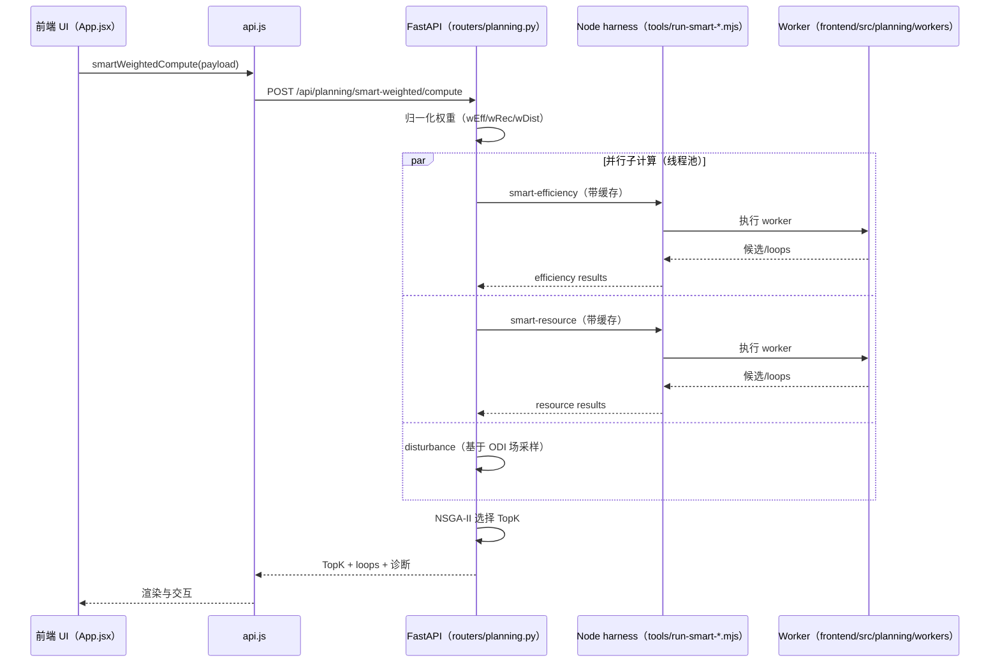

# 多场景覆岩扰动评估与采区智能规划系统：功能板块实现逻辑、约束与输出（证据锚点版，A~E 目录）

> 写作约束：本文档**只陈述仓库中可被代码定位的事实**；所有关键结论均给出“证据锚点”（文件路径 + 行号范围）。

---

## 目录（A~E）

- A. 系统研究目标与问题形式化（Formalization）
- B. 总体架构与数据流（Architecture & Dataflow）
- C. 功能模块划分与接口关系（按板块论文式说明）
- D. 关键算法、工程约束与验证口径
- E. 局限性与未来工作（仅基于代码事实）

---

## A. 系统研究目标与问题形式化（Formalization）

本系统面向“采区边界 + 钻孔数据 + 规程参数 + 场景权重/风险信息”等输入，提供从数据导入、地质/扰动场构建、采区工作面设计、智能规划候选生成、多目标排序到接续排程与经济评价的一体化工作流。

### A.1 输入 $\mathcal{X}$（数据与参数）

1) **空间几何输入**：采区边界多边形 $B$（点序列），以及设计/规划输出的工作面/煤柱/有效域等多边形环。边界与钻孔在后端存储时允许“原始坐标”，但会在读出时按 `coord_offset` 做归一化平移（用于与设计模块口径保持一致）。

证据锚点：
- 归一化边界/坐标偏移：[/backend_python/store.py](../backend_python/store.py#L118-L177)
- 边界读取 API：[/backend_python/routers/boundary.py](../backend_python/routers/boundary.py#L1-L9)

2) **钻孔与煤层属性输入**：钻孔坐标（CSV）与钻孔分层（批量 CSV）可分别上传；后端提供“合并坐标与分层数据”的接口，将字段映射为前端统一使用的 `coalThickness/gasContent/rockHardness/groundWater` 等属性；若缺少分层或匹配列，允许退化为随机/模拟数据以保证流程可跑通。

证据锚点：
- 钻孔坐标上传（CSV→标准列）：[/backend_python/routers/upload.py](../backend_python/routers/upload.py#L1-L45)，[/backend_python/utils/parsing.py](../backend_python/utils/parsing.py#L1-L61)
- 分层批量上传与煤层列表：[/backend_python/routers/boreholes.py](../backend_python/routers/boreholes.py#L1-L70)
- 坐标-分层合并与字段映射/默认值：[/backend_python/routers/boreholes.py](../backend_python/routers/boreholes.py#L72-L186)

3) **规程与设计参数输入**：工作面推进长度/煤柱宽度/边界煤柱/煤层倾角与倾向等由 `DesignParams` 接收，并通过 Pydantic 范围约束进行校验；采矿规程参数由 `MiningRules` 给出默认值，并支持按输入覆盖工作面长度范围与布置方向。

证据锚点：
- 参数校验模型 `DesignParams/MiningRulesConfig/FaceLengthConfig`：[/backend_python/routers/design.py](../backend_python/routers/design.py#L13-L75)
- 规程默认与约束函数：[/backend_python/utils/mining_rules.py](../backend_python/utils/mining_rules.py#L1-L140)

4) **扰动/风险与权重输入**：ODI 的权重约束要求 `wd + wo + wf = 1`；规划多目标权重（效率/回收/扰动）在后端会进行归一化（若无 ODI 场则强制 `wDist=0` 并重归一化）。

证据锚点：
- ODI 权重约束与归一化 `computeOdi`：[/frontend/src/App.jsx](../frontend/src/App.jsx#L17303-L17436)
- 规划权重归一化 `_norm_weights_2/_norm_weights_3`：[/backend_python/routers/planning.py](../backend_python/routers/planning.py#L268-L299)

### A.2 输出 $\mathcal{Y}$（结构化结果）
系统输出主要分为：
- **设计输出**：工作面多边形（points）、巷道路径（path）、统计信息（stats）以及用于 CAD 导出的图层/标注要素。
- **规划输出**：候选集合（含几何渲染 loops）、TopK 排名表、L2 差异诊断（几何等价/越界/拓扑碎片等）。
- **接续与经济输出**：接续计划（任务序列、月度产量等）及由风险联动修正后的现金流表、NPV、回收期、单位成本等指标。

证据锚点：
- 设计结果写入与返回字段：[/backend_python/routers/design.py](../backend_python/routers/design.py#L468-L545)
- 规划 L2 compare 结果结构：[/backend_python/routers/planning.py](../backend_python/routers/planning.py#L820-L1006)
- 经济评价输出结构：[/frontend/src/utils/economics.js](../frontend/src/utils/economics.js#L1-L149)

### A.3 目标与约束分层（Objectives & Constraints）

- **硬约束（必须满足）**：
  1) 采区边界必须可形成有效多边形；内缩后可采区不能为空或面积过小，否则返回空方案。
  2) 工作面长度/推进长度需满足规程范围（不满足时会标记为不合格或跳过/降级）。
  3) 规划/导出几何必须满足最小点数与基本合法性；CAD 导出对自交多边形采用“降级折线/失败”策略。

证据锚点：
- 内缩边界、MultiPolygon 处理、可采区过小直接失败：[/backend_python/utils/algorithms.py](../backend_python/utils/algorithms.py#L60-L120)
- 规程校验函数：[/backend_python/utils/mining_rules.py](../backend_python/utils/mining_rules.py#L106-L139)
- CAD 自交检测与降级策略：[/backend_python/routers/export_cad.py](../backend_python/routers/export_cad.py#L90-L214)

- **软目标（可权衡优化）**：
  1) 规划候选的效率/回收/扰动三目标（后端使用非支配排序 + 拥挤距离实现 TopK 选择）；
  2) 接续排程的月产量达标率、风险峰值、工期等（前端阶段3采用轻量启发式加权评分）。

证据锚点：
- NSGA-II TopK 选择：[/backend_python/routers/planning.py](../backend_python/routers/planning.py#L540-L618)
- 阶段3 KPI 与情景评分：[/frontend/src/utils/successionStage3.js](../frontend/src/utils/successionStage3.js#L1-L170)

---

## B. 总体架构与数据流（Architecture & Dataflow）

系统采用“前端交互 + 后端 API 编排 +（局部）Node harness 复用前端 worker”混合架构：前端通过 `API_BASE` 统一拼装 `/api/*` 请求；后端 FastAPI 负责路由分发、SQLite 持久化、部分算法计算（设计、地质、GNN、CAD 导出等）以及对规划算法的 L2 兼容执行（通过 Node.js 调用前端 worker 算法）。

证据锚点：
- FastAPI 路由注册与 /api 前缀：[/backend_python/main.py](../backend_python/main.py#L44-L70)
- 前端 API_BASE 与统一请求封装：[/frontend/src/api.js](../frontend/src/api.js#L1-L120)
- planning “L2-first：复用前端 worker”说明：[/backend_python/routers/planning.py](../backend_python/routers/planning.py#L1030-L1068)

### B.1 架构图（Mermaid）

```mermaid
flowchart LR
  UI[前端 UI: React App.jsx] --> API[frontend/src/api.js]
  API -->|HTTP /api/*| FASTAPI[FastAPI backend_python/main.py]

  FASTAPI --> STORE[SQLite Store: backend_python/store.py]

  FASTAPI -->|设计| DESIGN[routers/design.py + utils/algorithms.py]
  FASTAPI -->|地质插值| GEO[routers/geology.py]
  FASTAPI -->|GNN/IDW| GNN[routers/gnn_geology.py]
  FASTAPI -->|CAD(规范DXF)| DXF1[routers/design.py export/dxf]
  FASTAPI -->|CAD(结构化DXF)| DXF2[routers/export_cad.py]

  FASTAPI -->|规划 compute| PLAN[routers/planning.py]
  PLAN -->|Node harness| NODE[tools/run-smart-*.mjs]
  NODE -->|复用 worker 口径| WORKER[frontend/src/planning/workers/*.worker.js]

  UI -->|ODI/协同调控/经济/阶段3| LOCAL[前端本地计算 utils/*.js]
```

### B.2 数据流与状态持久化

后端使用 SQLite 表 `projects` 持久化边界、钻孔、分层、地质模型、评分网格与设计结果等字段；`coord_offset` 用于将大坐标平移到局部坐标系并在钻孔/边界读取时保持一致。

证据锚点：
- 数据库存储结构与字段：[/backend_python/store.py](../backend_python/store.py#L14-L66)
- 归一化逻辑与 coord_offset：[/backend_python/store.py](../backend_python/store.py#L118-L177)

---

## C. 功能模块划分与接口关系（按板块论文式说明）

> 约束：每个模块段落控制在约 200~400 字，并给出输入/约束/输出及证据锚点。

### C.1 数据导入与归一化模块（边界/钻孔/分层）

该模块负责将 CSV/JSON 数据转为系统内部统一结构，并在必要时进行归一化坐标处理。边界 CSV 通过 `parse_csv_file` 读取并在 `normalize_columns(...,'boundary')` 中宽松匹配 x/y 列名；上传后强制闭合首尾点并写入 `store.boundary`。钻孔坐标 CSV 同样通过宽松列匹配识别 id/x/y，并写入 `store.borehole_coordinates`。分层数据支持批量上传，后端会保留 `store.borehole_layer_data` 作为原始表，并提供煤层列表检索接口。随后可调用“merge-with-coordinates”将坐标与分层按孔号（或源文件名推断）聚合合并，并将常见字段映射到 `coalThickness/gasContent/rockHardness/groundWater`，若字段缺失则按默认值补齐；当缺少分层或无法匹配列时，系统允许退化为随机/模拟数据以保证流程可执行。

证据锚点：
- CSV 解析与列标准化：[/backend_python/utils/parsing.py](../backend_python/utils/parsing.py#L1-L61)
- 上传边界并闭合：[/backend_python/routers/upload.py](../backend_python/routers/upload.py#L1-L28)
- 上传钻孔坐标：[/backend_python/routers/upload.py](../backend_python/routers/upload.py#L29-L45)
- 分层批量上传/煤层列表：[/backend_python/routers/boreholes.py](../backend_python/routers/boreholes.py#L12-L70)
- 合并与字段映射/默认值：[/backend_python/routers/boreholes.py](../backend_python/routers/boreholes.py#L72-L186)
- 前端调用封装（upload/merge/coal-seams）：[/frontend/src/api.js](../frontend/src/api.js#L120-L210)

### C.2 采矿设计与规程约束模块（工作面/巷道）

该模块在后端完成“规程约束 + 几何切割 + 地质评分”的工作面布局生成。入口 `POST /api/design/` 通过 `DesignParams` 对推进长度、煤柱、边界煤柱、倾角/倾向等进行范围校验，并允许通过 `MiningRulesConfig` 覆盖工作面长度上下限与布置方向。核心算法 `generate_smart_layout` 先将边界点构造成 Shapely 多边形，并在无效时用 `buffer(0)` 尝试修复；随后按边界煤柱进行内缩，若内缩导致空域则自动降级（减半或使用原始边界），并处理 MultiPolygon（取最大区域）。在旋转到布局坐标系后，算法以条带方式切割可采区生成候选工作面，对每个候选检查工作面长度与推进长度规程约束，必要时将边缘工作面标为不合格或直接跳过；评分方面若存在 `geology_analyzer` 则在面中心点调用地质评分，否则给出基于面序的基础分。最终生成巷道网络并输出统计信息，结果写入 `store.design_result` 供 CAD 导出与后续模块使用。

证据锚点：
- 设计入口与参数校验：[/backend_python/routers/design.py](../backend_python/routers/design.py#L13-L75)，[/backend_python/routers/design.py](../backend_python/routers/design.py#L392-L545)
- 规程约束定义：[/backend_python/utils/mining_rules.py](../backend_python/utils/mining_rules.py#L12-L140)
- 核心布局算法（内缩/旋转/条带切割/规程校验/评分）：[/backend_python/utils/algorithms.py](../backend_python/utils/algorithms.py#L41-L220)
- 前端调用封装（generateDesign/getDesign）：[/frontend/src/api.js](../frontend/src/api.js#L322-L352)

### C.3 覆岩扰动评估（ODI）与协同调控模块

ODI 的核心计算在前端完成：`computeOdi(points, weights, scaleRef)` 对插值提取后的点集构建指标矩阵乘法，将原始因子映射到多个中间指标并按 `wd/wo/wf` 三类权重加权得到 `odi`；函数要求 `wd+wo+wf=1`，否则返回错误。为了避免某些因子在当前数据下全零或常数导致矩阵退化，代码会基于各因子行的分布执行“退化行剔除 + 列归一化”。计算结果同时维护 `minOdi/maxOdi`，并支持通过 `scaleRef` 复用旧标尺：即使新 odi 超出旧范围，也会使用 `clamp01` 将 `odiNorm` 强制裁剪到 [0,1]，以保证后续可视化与插值的一致口径。UI 侧 `handleComputeOdi` 触发计算并清空基于旧 ODI 的派生结果（实测分区/误差评估等），体现了“场更新 → 相关派生状态失效”的工程约束。

证据锚点：
- ODI 计算（矩阵乘法、退化行剔除、权重约束、归一化）：[/frontend/src/App.jsx](../frontend/src/App.jsx#L17303-L17447)
- UI 触发与派生结果作废：[/frontend/src/App.jsx](../frontend/src/App.jsx#L14550-L14567)

### C.4 地质参数分析模块（插值 + 分层 + GNN/IDW）

该模块在后端提供两条“由钻孔到空间场”的建模路径。其一是 `POST /api/geology/` 使用 `griddata` 将钻孔点的 `coalThickness` 插值到规则网格：当 cubic 插值失败时自动回退为 linear，并对 NaN 进行 `nan_to_num` 处理后写入 `store.geology_model`。其二是 `POST /api/gnn/train` 等接口提供简化的图基础预测器：训练阶段用 KDTree 建立空间邻域，预测阶段对最近 k 个钻孔做反距离平方加权，输出厚度/底板/顶板与距离置信度，并支持生成网格与 LOO 交叉验证（MAE/RMSE/R2）。同时，`GET /api/geology/layers` 可从分层表中按孔号聚合生成完整地层序列；若缺少分层数据但存在合并后的钻孔数据，则可生成模拟分层（含随机性）以支持 3D 展示流程。

证据锚点：
- geology 插值（griddata + fallback + NaN 处理 + store 写入）：[/backend_python/routers/geology.py](../backend_python/routers/geology.py#L146-L210)
- 分层聚合与模拟分层：[/backend_python/routers/geology.py](../backend_python/routers/geology.py#L10-L144)
- GNN/IDW 预测器（KDTree + 反距离平方加权 + cross_validate）：[/backend_python/routers/gnn_geology.py](../backend_python/routers/gnn_geology.py#L44-L209)
- 前端调用封装（generateGeology/getGeology/getBoreholeLayers/train/predict）：[/frontend/src/api.js](../frontend/src/api.js#L354-L392)

### C.5 采区智能规划模块（smart-efficiency / smart-resource / smart-weighted）

规划模块采取“L2-first”工程策略：后端 `routers/planning.py` 并不直接重写前端 worker 的几何搜索逻辑，而是通过 Node.js harness 调用仓库内 `tools/run-smart-*.mjs`，以复用 `frontend/src/planning/workers/*.worker.js` 的既有算法口径，从而保证前后端输出结构与数值一致。为降低重复计算成本，后端对 Node harness 的输出按 payload 的稳定哈希（JSON sort_keys）进行进程内缓存，并设置简单的 LRU-ish 淘汰；同时在 weighted 端点中使用线程池并行执行 efficiency/recovery/(可选)disturbance 三次子计算，缩短 wall-clock 时间而不改变确定性输出。多目标融合方面，后端在得到候选池后可基于 ODI 场对每个候选做网格采样计算扰动分（mean/p90/exceedRatio → points），并使用非支配排序与拥挤距离实现 NSGA-II TopK 选择；此外提供 L2 compare 端点对几何进行 snap/simplify 后的对称差/越界/拓扑碎片诊断，作为“算法迁移或参数调整时的等价性验收口径”。

证据锚点：
- Node harness 结果缓存（稳定 hash + LRU-ish）：[/backend_python/routers/planning.py](../backend_python/routers/planning.py#L20-L104)
- smart-efficiency/smart-resource 后端入口（L2-first 说明）：[/backend_python/routers/planning.py](../backend_python/routers/planning.py#L1030-L1145)，[/backend_python/routers/planning.py](../backend_python/routers/planning.py#L1189-L1258)
- 扰动采样评分（polygon union + grid sampling + quantile 标定）：[/backend_python/routers/planning.py](../backend_python/routers/planning.py#L380-L519)
- NSGA-II TopK：[/backend_python/routers/planning.py](../backend_python/routers/planning.py#L540-L618)
- L2 compare（snap/simplify + 几何差异诊断）：[/backend_python/routers/planning.py](../backend_python/routers/planning.py#L820-L1018)
- 前端调用封装（smartEfficiency/smartResource/smartWeighted）：[/frontend/src/api.js](../frontend/src/api.js#L120-L206)

流程图（Mermaid）：



### C.6 采掘接续计划与工程经济分析模块

接续模块提供“后端 RL 训练/优化 + 前端启发式对比”的双通道实现。后端 `routers/succession.py` 定义了接续训练状态并通过 `BackgroundTasks` 启动训练；训练循环基于 `MineSuccessionEnv` 环境按 episode 采样轨迹，使用动作掩码约束有效动作，并调用 `agent.update(trajectories)` 更新 PPO 策略；优化端点在存在已训练模型时优先复用最新模型，否则快速训练后生成接续方案并导出甘特数据。另一方面，前端阶段3提供轻量启发式：从排程结果与协同调控曲线中估计月度风险峰值，并按“产量达标率、最大缺口、风险峰值、工期”等指标做加权评分以对比多个参数候选。经济模块完全在前端执行：`computeEconomicsFromPlan` 将月度产量转为现金流，并支持风险联动减产与额外成本，最终输出 NPV、回收期、单位成本/利润等指标。

证据锚点：
- 后端 RL 训练入口与简化训练循环：[/backend_python/routers/succession.py](../backend_python/routers/succession.py#L60-L170)
- 后端优化端点与“无模型则快训”逻辑：[/backend_python/routers/succession.py](../backend_python/routers/succession.py#L171-L260)
- 前端风险估计与情景评分：[/frontend/src/utils/successionStage3.js](../frontend/src/utils/successionStage3.js#L63-L170)
- 前端经济评价（现金流/NPV/回收期/单位成本）：[/frontend/src/utils/economics.js](../frontend/src/utils/economics.js#L1-L149)
- 前端 API 调用封装（succession 端点）：[/frontend/src/api.js](../frontend/src/api.js#L400-L520)

---

## D. 关键算法、工程约束与验证口径

### D.1 关键算法与工程约束：代码级检索与归纳

#### D.1.1 几何域构造、裁剪与合法性处理

1) **设计布局（Shapely）**：边界多边形无效时用 `buffer(0)` 修复；内缩产生 MultiPolygon 时取最大区域；工作面条带切割后对几何类型做守护（Polygon/MultiPolygon/GeometryCollection）。

证据锚点：[/backend_python/utils/algorithms.py](../backend_python/utils/algorithms.py#L60-L170)

2) **规划几何对齐（L2 compare）**：对 loops 点列执行 snap（mm→m）与相邻点去重，强制闭合，并对简化后无效几何再次 `buffer(0)` 修复；诊断指标包括对称差比例、越界面积、bbox 偏差、质心偏移与拓扑碎片最大面积。

证据锚点：[/backend_python/routers/planning.py](../backend_python/routers/planning.py#L850-L1018)

3) **CAD 导出合法性**：结构化导出在闭合多边形上做自交检测；边界与有效域在发现自交时允许降级为折线输出以避免整单失败；工作面若无效则直接失败。

证据锚点：[/backend_python/routers/export_cad.py](../backend_python/routers/export_cad.py#L90-L279)

#### D.1.2 候选生成、可行性判定与失败类型

- **设计候选**：条带切割生成工作面候选，长度过短直接跳过；长度不满足规程时可降级为“不合格但保留”，并在输出中携带 `validationMsg`。

证据锚点：[/backend_python/utils/algorithms.py](../backend_python/utils/algorithms.py#L160-L240)

- **规划候选**：smart-efficiency/smart-resource 的核心候选生成在前端 worker 内（通过 Node harness 复用）；后端在超时或异常时返回统一失败结构，并在 `attemptSummary.failTypes` 中记录失败类型。

证据锚点：
- Node harness 超时/异常失败回包：[/backend_python/routers/planning.py](../backend_python/routers/planning.py#L1146-L1179)，[/backend_python/routers/planning.py](../backend_python/routers/planning.py#L1231-L1258)
- 前端请求超时放宽（120s/180s）：[/frontend/src/api.js](../frontend/src/api.js#L147-L205)

#### D.1.3 扰动/风险指标体系与采样口径

后端 weighted 模式下的扰动评估基于 ODI 场：对候选多边形 union 后在其 bbox 内按固定步长生成采样网格点（保持确定性顺序），仅统计落在多边形内部的采样点；随后计算 mean、p90 与 exceedRatio（超过阈值比例），并按权重线性组合得到 raw score，再用 5%~95% 分位数将其映射为 60~95 的 points（越高越好）。该设计显式将“风险阈值超标比例”作为独立项加入评分，以支持协同调控场景下的阈值合规偏好。

证据锚点：[/backend_python/routers/planning.py](../backend_python/routers/planning.py#L401-L519)

前端 ODI 的归一化强制落在 [0,1]，用于后续插值与展示口径一致；当复用旧标尺（scaleRef）时也会对越界值做裁剪，避免出现负值或大于 1 的可视化异常。

证据锚点：[/frontend/src/App.jsx](../frontend/src/App.jsx#L17392-L17436)

#### D.1.4 多目标优化与排序去重策略

weighted 端点的 TopK 选择采用 NSGA-II 的经典组合：先执行快速非支配排序得到 Pareto fronts，再在同一 front 内按拥挤距离降序补齐到 K，以在多目标之间保持解集多样性。

证据锚点：[/backend_python/routers/planning.py](../backend_python/routers/planning.py#L540-L618)

#### D.1.5 可复现性旋钮（inputs/params/cacheKey/timeout）

- **规划复现**：Node harness 缓存键由 payload 的稳定哈希生成；前端同样提供 `cacheKey` 透传以对齐 worker 的确定性随机/候选枚举路径（具体 RNG 口径在 worker 内）。

证据锚点：
- 稳定 hash + Node 结果缓存：[/backend_python/routers/planning.py](../backend_python/routers/planning.py#L20-L104)
- 测试脚本显式设置 cacheKey：[/tools/test_smart_efficiency_backend.py](../tools/test_smart_efficiency_backend.py#L22-L58)

- **ODI/协同调控复现**：ODI 权重必须满足和为 1；scaleRef 可用于“保留旧标尺”并确保归一化输出仍在 [0,1]。

证据锚点：[/frontend/src/App.jsx](../frontend/src/App.jsx#L17303-L17436)

- **地质/网格复现**：插值分辨率 `resolution` 作为显式参数写入 `store.geology_model`；GNN/IDW 的邻居数 `k_neighbors` 与训练/预测的钻孔数据决定输出。

证据锚点：[/backend_python/routers/geology.py](../backend_python/routers/geology.py#L146-L210)，[/backend_python/routers/gnn_geology.py](../backend_python/routers/gnn_geology.py#L44-L120)

#### D.1.6 算法模块清单（按“几何处理/候选生成/可行性/评分/优化/排序去重”检索归纳）

| 类别 | 算法/函数 | 作用 | 输入→输出 | 复杂度（代码层面） | 实现锚点 | 调用锚点 |
|---|---|---|---|---|---|---|
| 几何处理 | `create_polygon_from_points` | 点序列→闭合 Polygon | points→Polygon | $O(n)$ | [/backend_python/utils/algorithms.py](../backend_python/utils/algorithms.py#L41-L56) | [/backend_python/utils/algorithms.py](../backend_python/utils/algorithms.py#L78-L90) |
| 候选生成 | `generate_smart_layout`（条带切割） | 采区内生成工作面候选 | boundary+rules→workfaces/roadways/stats | 主要由条带数与几何相交决定 | [/backend_python/utils/algorithms.py](../backend_python/utils/algorithms.py#L60-L220) | [/backend_python/routers/design.py](../backend_python/routers/design.py#L430-L505) |
| 可行性判定 | `MiningRules.validate_face_length/validate_advance_length` | 规程校验 | length→(bool,msg) | $O(1)$ | [/backend_python/utils/mining_rules.py](../backend_python/utils/mining_rules.py#L106-L139) | [/backend_python/utils/algorithms.py](../backend_python/utils/algorithms.py#L170-L210) |
| 评分(ODI) | `computeOdi` | ODI 计算与归一化 | points+weights→{points,min/max} | $O(N\cdot R\cdot C)$（显式三重循环） | [/frontend/src/App.jsx](../frontend/src/App.jsx#L17303-L17436) | [/frontend/src/App.jsx](../frontend/src/App.jsx#L14550-L14567) |
| 评分(扰动) | `_compute_disturbance_for_candidates` | 基于 ODI 场的候选扰动采样评分 | candidates+field→bySignature stats | bbox 网格采样 $O(M)$（采样点数上限由 maxSamples 约束） | [/backend_python/routers/planning.py](../backend_python/routers/planning.py#L401-L519) | [/backend_python/routers/planning.py](../backend_python/routers/planning.py#L1555-L1612) |
| 优化选择 | `_select_topk_nsga` | NSGA-II TopK | objs→selected | $O(n^2)$ 级（双层支配关系） | [/backend_python/routers/planning.py](../backend_python/routers/planning.py#L540-L618) | [/backend_python/routers/planning.py](../backend_python/routers/planning.py#L1660-L1720) |
| 排序去重 | `buildStage3Candidates` | 阶段3候选去重 | baseParams→candidates | $O(K)$ + Set 去重 | [/frontend/src/utils/successionStage3.js](../frontend/src/utils/successionStage3.js#L171-L256) | [/frontend/src/App.jsx](../frontend/src/App.jsx#L13869-L13874) |
| 地质插值 | `generate_geology`（griddata） | 钻孔厚度→网格场 | points→grid_z | 由 griddata 决定 | [/backend_python/routers/geology.py](../backend_python/routers/geology.py#L146-L210) | [/frontend/src/api.js](../frontend/src/api.js#L354-L371) |
| GNN/IDW | `GraphBasedGeologyPredictor.predict_at` | KDTree kNN + IDW | (x,y)→thickness/floor/roof | 查询 $O(\log n + k)$ | [/backend_python/routers/gnn_geology.py](../backend_python/routers/gnn_geology.py#L88-L140) | [/backend_python/routers/gnn_geology.py](../backend_python/routers/gnn_geology.py#L237-L286) |
| 经济评价 | `computeEconomicsFromPlan` | 现金流/NPV/回收期 | plan+risk+params→rows/summary | $O(T)$（月数） | [/frontend/src/utils/economics.js](../frontend/src/utils/economics.js#L1-L149) | [/frontend/src/App.jsx](../frontend/src/App.jsx#L13852-L13859) |

> 说明：表中个别“调用锚点”若在本仓库版本中未能通过稳定符号定位（例如 App.jsx 内联调用点过多且未拆分文件），应以进一步检索补齐；本文档不使用不可定位的 `???` 行号锚点。

---

### D.2 工程案例、验证口径与可追溯性

#### D.2.1 健康检查与请求日志

后端提供 `/health` 与 `/api/health` 作为服务可用性验证；并通过中间件记录 API 请求（排除健康检查等高频路径），日志同时输出到控制台与按日滚动的文件。

证据锚点：
- health 端点：[/backend_python/main.py](../backend_python/main.py#L72-L97)
- 请求日志中间件：[/backend_python/main.py](../backend_python/main.py#L44-L63)
- 日志配置与文件落盘：[/backend_python/utils/logger.py](../backend_python/utils/logger.py#L1-L80)

#### D.2.2 规划模块的端到端验证脚本

仓库提供多个 planning 相关脚本用于“可运行验证”：例如 `tools/test_smart_efficiency_backend.py` 使用固定矩形边界与 cacheKey 调用 `/api/planning/smart-efficiency/compute`；`tools/test_smart_resource_backend.py` 支持从 JSON 载入 payload 并可额外调用 `/api/planning/l2/compare` 与 baseline 结果做几何一致性对比；`tools/quick_check_smart_resource_backend.py` 则构造包含 fullCover/segmentWidth/cleanupResidual 等复杂旋钮的 payload，用于检查候选多样性与 patch 字段是否齐全。

证据锚点：
- smart-efficiency 脚本：[/tools/test_smart_efficiency_backend.py](../tools/test_smart_efficiency_backend.py#L1-L58)
- smart-resource 脚本（含 L2 compare）：[/tools/test_smart_resource_backend.py](../tools/test_smart_resource_backend.py#L1-L65)
- quick check（复杂旋钮 payload）：[/tools/quick_check_smart_resource_backend.py](../tools/quick_check_smart_resource_backend.py#L70-L206)

#### D.2.3 工程输入快照校验

`tools/validate_project_snapshot.mjs` 对项目输入快照 JSON 执行结构校验（kind/schemaVersion/字段白名单），并对 planningDisturbanceParams 做归一化与合法性检查，给出 warn/error 级别问题列表，以支持“导入-复现”的工程闭环。

证据锚点：[/tools/validate_project_snapshot.mjs](../tools/validate_project_snapshot.mjs#L1-L194)

---

## E. 局限性与未来工作（仅基于代码事实）

1) **评分模块为占位实现**：`/api/score/` 当前生成的网格数据来自 `np.random.randint`，注释也明确“实际应包含插值逻辑”，因此不能作为真实地质/风险评分依据，只能用于前端热力图结构兼容。

证据锚点：[/backend_python/routers/score.py](../backend_python/routers/score.py#L1-L55)

2) **部分前端 API 封装未在 Python 后端实现**：例如前端定义了 `/upload/borehole-data`、`/upload/batch`、`/upload/status`、`/upload/template/*` 等封装，但当前 Python `routers/upload.py` 仅实现 boundary 与 borehole-coordinates 两个端点；同样，前端 `uploadBoundary(points)` 以 JSON POST `/boundary/` 的封装在 Python `routers/boundary.py` 中并不存在对应 POST 路由。这些差异意味着某些 UI/脚本路径可能依赖旧后端或尚未迁移完成。

证据锚点：
- Python upload 路由现状：[/backend_python/routers/upload.py](../backend_python/routers/upload.py#L1-L45)
- 前端上传 API 封装：[/frontend/src/api.js](../frontend/src/api.js#L120-L240)
- Python boundary 路由现状：[/backend_python/routers/boundary.py](../backend_python/routers/boundary.py#L1-L9)

3) **规划缓存为进程内缓存**：Node harness 与 weighted cache 均为内存字典并带上限淘汰，不具备跨进程/跨机器一致性；服务重启会丢失缓存。

证据锚点：[/backend_python/routers/planning.py](../backend_python/routers/planning.py#L20-L118)

4) **模拟/随机数据引入非确定性**：地质分层模拟与钻孔 mock 数据生成使用 `np.random.random()`，会导致在无真实输入时的输出不可复现。

证据锚点：
- mock 分层随机性：[/backend_python/routers/geology.py](../backend_python/routers/geology.py#L86-L144)
- mock 钻孔属性随机性：[/backend_python/routers/boreholes.py](../backend_python/routers/boreholes.py#L188-L204)

---

## 附录A：模块-接口索引（便于审稿追踪）

- FastAPI 路由注册总览：[/backend_python/main.py](../backend_python/main.py#L44-L70)
- 前端 API 封装总览：[/frontend/src/api.js](../frontend/src/api.js#L1-L520)

