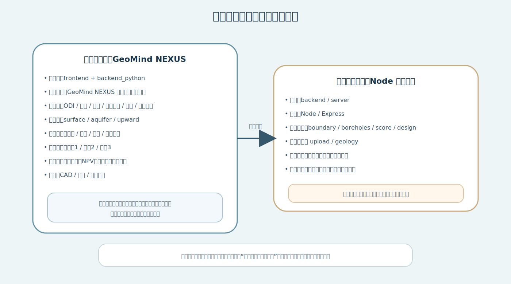
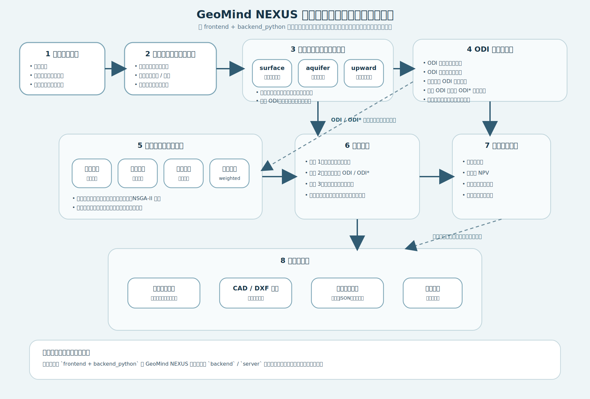
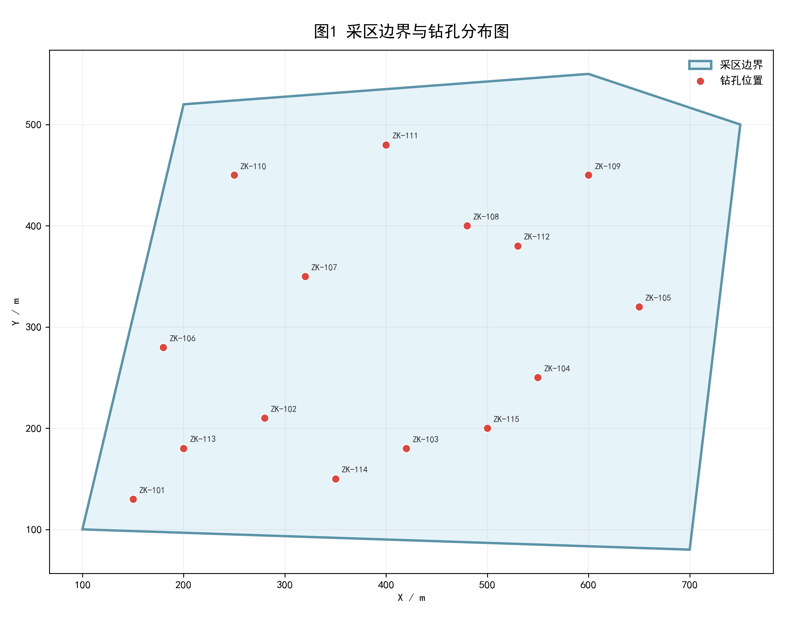
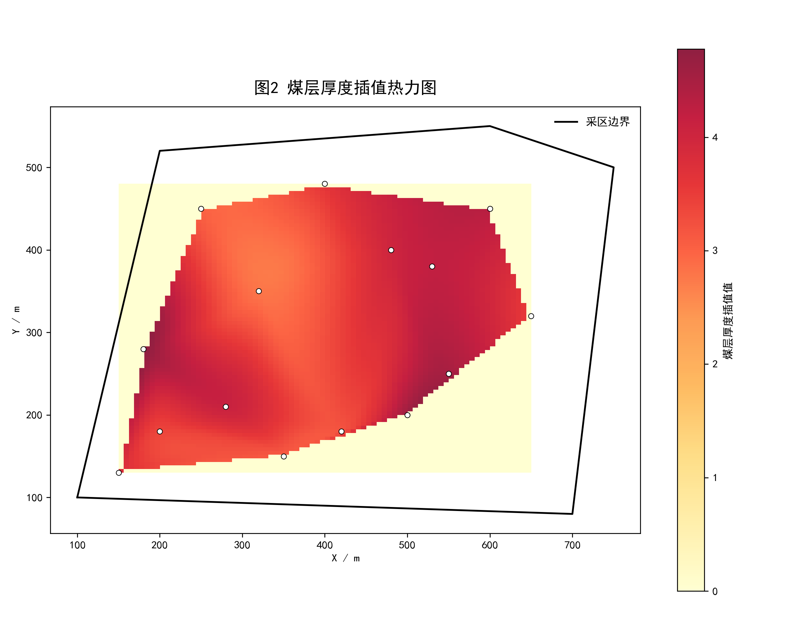
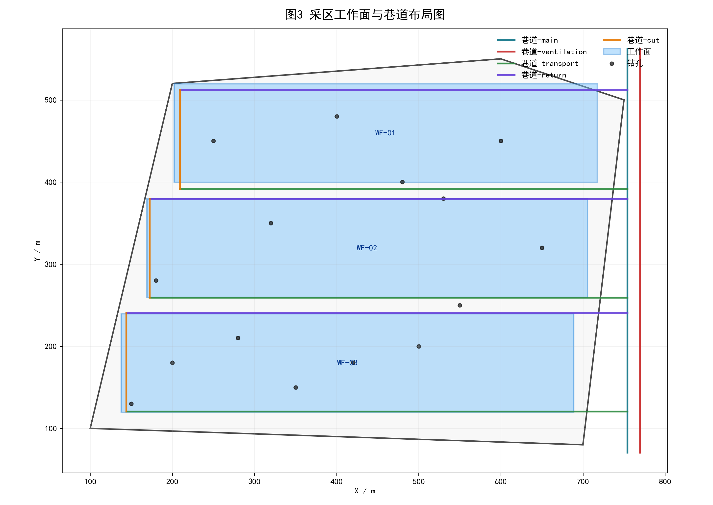
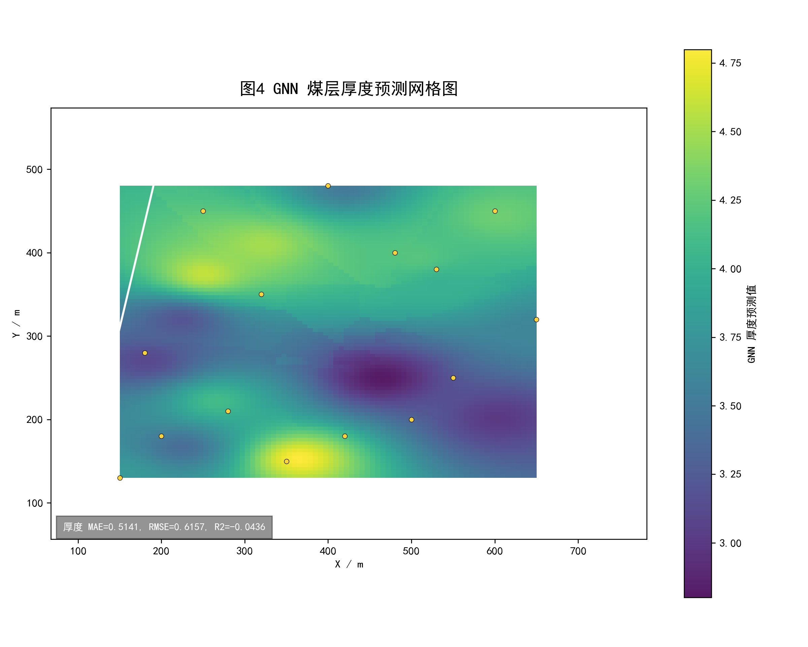

# 采区智能规划设计一体化方法与系统

作者：[待填写]  
单位：[待填写]  
基金项目：[待填写]  
中图分类号：[待填写]  
文献标志码：A  

摘要：针对传统采区规划设计中地质数据处理、参数场构建、方案布局、采掘接续与工程经济评价相互割裂，造成方案迭代效率低、风险分析后置、成果难追溯的问题，构建了采区智能规划设计一体化方法与系统。依据项目现有代码体系和线上运行版本，首先完成新版 `frontend + backend_python` 主系统与旧版 Node 原型系统的边界划分；在此基础上，围绕多源数据标准化、三场景分析、地质参数场构建、ODI 风险表征与协同调控、四模式智能规划、三阶段采掘接续和工程经济分析等环节，重构面向采区规划的完整业务链与方法组织关系；结合仓库样例数据和本地复现实验，对系统主流程进行了贯通验证。结果表明：系统在界面层形成 `odi`、`geology`、`planning`、`cocontrol`、`succession`、`economics` 6 类主视图，在分析层支持 `surface`、`aquifer`、`upward` 3 类场景，在规划层实现工程效率最优、资源回收最优、覆岩扰动优化和权重综合优化 4 种模式；样例运行可稳定生成采区边界与钻孔分布图、煤层厚度插值热力图、工作面与巷道布局图及 GNN 预测网格图，并得到 3 个工作面、11 条巷道的设计结果。结果表明，该系统已由局部设计原型演进为面向采区规划设计的一体化平台，具备“数据导入-参数场构建-风险分析-多目标规划-采掘接续-经济评价-成果导出”的闭环实现能力，可为后续真实矿井案例验证与参数标定提供系统基础；但现阶段验证仍主要停留在样例级和工程原型级层面，相关结论尚需结合实矿数据进一步检验。  

关键词：采区规划；智能采掘设计；一体化系统；ODI；协同调控；采掘接续；工程经济分析  

## 0 引言

采区规划设计处于煤矿生产技术决策链的前端，其结果直接影响工作面布置、巷道工程量、资源回收率、生产接续组织、安全风险控制以及投资收益水平。长期以来，煤矿采区规划工作往往依赖边界图件、钻孔资料、地质分层表、经验参数和多套离散软件协同完成，形成了“数据处理在前、布局设计居中、接续与经济分析后置”的串行式工作模式。该模式在工程实践中存在 3 类突出问题：一是原始数据、地质模型与设计参数上下文分散，难以形成统一的工程对象；二是风险分析、接续组织和经济评价往往脱离布局设计主流程，导致方案迭代周期长、信息重复录入多；三是设计成果常停留于单张图件或局部指标，缺乏跨模块联动和过程留痕能力[1,2,3,4,5]。

随着矿山数字化、智能化建设持续推进，采区规划软件的研究重点正在由单点算法或单功能设计工具向平台化、一体化规划系统转变。然而在项目研发和论文表达中，经常出现另一类问题，即将局部功能模块误写成完整系统，或在版本迭代过程中将旧版原型与新版平台混合表述，导致研究对象不清、架构边界不稳、验证结论失真。对于本项目而言，这一问题尤为典型：仓库中既保留了早期 Node/Express 设计原型，也已经形成了以 React 前端和 Python FastAPI 后端为主线的新版智能采掘设计系统。若不首先厘清新旧系统的边界，论文后续有关总体架构、关键方法和验证结果的讨论就容易出现偏差[6,7,8,9,10,11]。

基于此，本文以当前线上运行的新版智能采掘设计系统为研究对象，不再沿用旧版“基础设计系统”或“局部布局算法”的表述口径，而从系统工程角度讨论其平台边界、关键方法和样例级验证结果。本文的主要工作包括：1）完成新旧系统边界划分，明确新版 `frontend + backend_python` 为论文主线；2）从平台视角重构系统的总体架构与业务链路，梳理多源数据、三场景分析、风险表征、智能规划、采掘接续和工程经济之间的关系；3）基于代码实现和样例运行结果，对系统关键方法进行论文式归纳；4）结合线上新版系统识别和本地复现实验，对系统现阶段的样例级可行性进行验证，并给出其适用边界与后续完善方向。

## 1 系统边界与总体架构

### 1.1 研究对象界定与版本边界

从项目目录结构看，当前仓库同时包含 `backend/`、`server/` 和 `backend_python/` 3 类后端目录。其中，`backend/` 与 `server/` 采用 Node/Express 结构，主要围绕边界、钻孔、评分、基础设计等接口展开，体现的是较早期“数据导入-布局生成-结果导出”的原型链路；`backend_python/` 则采用 FastAPI 结构，统一注册 `upload`、`boreholes`、`design`、`score`、`boundary`、`geology`、`succession`、`gnn_geology`、`planning`、`export_cad` 等路由，并与 `frontend` 主界面共同构成当前主系统。由此可见，项目处于典型的新旧系统并存阶段。

为避免仅依据目录命名作出判断，本文进一步核对了用户提供的线上系统地址 [http://39.97.168.66/](http://39.97.168.66/)。线上页面标题与本地 `frontend/dist/index.html` 标题一致，说明当前线上运行对象与新版前端发布版本相匹配。因此，本文后续讨论对象明确限定为当前线上新版平台，旧版 Node 原型系统仅作为演进背景和对照对象存在。

图 1 给出了新旧系统版本边界示意图。本文统一采用如下口径：`frontend + backend_python` 为新版主系统；`backend` 与 `server` 为历史原型链路；凡涉及新版平台能力、功能闭环和结果验证的论述，均以新版主系统为依据。该边界是后续方法归纳与结论表述的前提。

### 1.2 平台化采区规划的需求分解

面向采区规划设计的平台至少应满足以下 5 个方面的需求：1）现场边界、钻孔、分层和设计参数能够在同一项目上下文中统一组织；2）离散地质样点和场景参数能够转化为可供规划直接调用的连续参数场；3）规划结果能够在不同目标函数下生成、比较和筛选，而非只输出单一方案；4）空间布局结果能够进一步进入采掘接续组织与产量分析；5）接续结果能够继续传递到工程经济评价和成果导出归档环节。

与传统工具相比，新版系统的重要变化就在于其试图同时覆盖上述 5 类需求，使“数据、模型、规划、接续、经济、导出”处于同一平台中，而不是分散在多个互不联通的软件和表格中。对于采区规划这种强耦合业务场景而言，这种平台化组织比单点算法优化更接近实际工程工作方式[1,2,3,4,5,8,9,10,11]。

### 1.3 总体流程与分层架构

结合前端主视图、后端路由和样例运行结果，本文将新版系统的总体流程概括为：多源数据输入与标准化、项目快照与状态管理、三场景分析、地质参数场构建、ODI 风险表征与协同调控、四模式智能规划、三阶段采掘接续、工程经济分析以及成果导出与归档 9 个环节。各环节之间并非单向串联关系，而是通过共享项目状态、共享参数场和共享候选结果形成可迭代的闭环链路。

图 2 表明新版系统已经超出“输入-设计-导出”的窄链路模式，呈现出多模块联动的平台化结构。尤其是 ODI、协同调控、智能规划、采掘接续和工程经济分析之间的耦合，是新版系统区别于旧版原型的关键特征[3,4,5,7,11]。

从工程实现上，可将系统划分为 4 个层次。第一层为数据与项目管理层，负责边界、钻孔、分层、设计结果和项目状态的统一组织与存取；第二层为场景分析与参数场构建层，负责三场景组织、地质插值和扩展建模；第三层为规划与决策层，负责 ODI 与协同调控、四模式规划、接续优化和经济评价；第四层为输出与归档层，负责图件、CAD 和结构化结果导出。该分层表明新版系统已具备较清晰的“输入-分析-决策-交付”平台结构[3,4,5,7,11]。

## 2 关键方法

### 2.1 多源数据标准化与项目快照机制

新版系统的数据输入主要包括采区边界、钻孔坐标、钻孔分层和相关设计参数。与旧版相比，其核心提升并非仅在于增加数据类型，而在于将输入对象纳入统一项目上下文。后端存储层除保存边界、钻孔和设计结果外，还保存地质模型、归一化坐标偏移和项目状态；前端则提供项目快照保存、恢复和模式版本管理功能，使同一采区的多轮试算具备上下文连续性。

从方法角度看，该机制的作用在于构建统一输入空间 $\mathcal{X}$。系统将原始边界、钻孔与参数对象映射为后续各模块可共同使用的结构化输入集合，为三场景分析、规划与接续评价提供统一数据底座。对采区规划这样典型的多参数、多轮试算问题而言，项目快照不是附属功能，而是支持结果复现、方案比选和后续回溯的重要基础[5,8,9,10,11]。

### 2.2 三场景分析与地质参数场构建

新版系统以前端主状态形式显式组织 `surface`、`aquifer`、`upward` 3 类分析场景，说明其风险与参数组织不再围绕单一指标展开，而是面向不同工程对象进行场景化建模。该结构的重要性在于：后续 ODI 计算、协同调控和规划评价能够基于统一场景框架完成参数切换和风险权衡[6,7,8,9,10]。

在地质建模方面，系统至少包含 2 条能力链。其一是基于钻孔数据的规则网格插值链，用于生成煤层厚度等连续参数场；其二是基于图模型思想的扩展建模链，用于探索小样本条件下的结构化预测。对于给定钻孔样点集合 $\{(x_i,y_i,z_i)\}$，系统通过插值或邻域推理构造规划域上的参数场 $G(x,y)$，从而将离散钻孔样点转化为规划评价可直接调用的连续空间信息[8,9,10,11,12]。

图 3 表明系统以采区边界和钻孔点位作为底层空间对象组织数据，说明新版平台仍严格建立在几何边界约束之上。

图 4 所示煤层厚度插值热力图表明，系统已经具备从离散钻孔向连续参数场转换的基本能力，并可为后续规划和风险评价提供底图支撑。

### 2.3 ODI风险表征与协同调控

新版系统与旧版系统的一个本质差别，是 ODI 不再只是结果页中的附属指标，而被提升为一级主视图，并进一步进入协同调控、扰动优化和接续风险链。前端不仅维护 ODI 结果，还维护 ODI 标尺复用、百分位阈值、方案排行、范围对比和调试参数等状态，说明 ODI 已被视为跨模块传播的中介变量。

结合实现逻辑，可将 ODI 的核心计算关系归纳为

$$
ODI = w_d I_d + w_o I_o + w_f I_f \qquad （1）
$$

$$
w_d + w_o + w_f = 1 \qquad （2）
$$

式中，$I_d$、$I_o$、$I_f$ 分别表示不同因子维度下的归一化指标，$w_d$、$w_o$、$w_f$ 为相应权重。系统要求权重和为 1，并在复用旧标尺时对归一化结果进行裁剪，以保证不同方案、不同场景下的 ODI 结果可在统一尺度内比较。式（1）和式（2）是基于代码实现逻辑对计算关系的归纳表达，用于论文描述，并非系统原始文档中的唯一数学定义。

协同调控模块的关键作用并不只是展示风险热力分布，而是将 ODI 进一步组织为方案筛选、范围对比和风险联动的依据。也就是说，新版系统已从“生成风险图”扩展到“让风险场真正参与规划决策”，这是其平台化能力的重要体现。

### 2.4 四模式智能规划

旧版系统的规划逻辑主要集中于工作面与巷道布局生成；新版系统则在此基础上形成了工程效率最优、资源回收最优、覆岩扰动优化和权重综合优化 4 种规划模式，并围绕这些模式构建统一的候选生成与比较框架。前端 `MultiObjectivePlanPanel` 明确给出了 4 类模式入口，后端 `planning` 路由则提供与之对应的计算接口[12,13,14,15,16,19,20]。

从方法上看，四模式规划不是 4 套彼此独立的解算按钮，而是同一候选方案池在不同目标函数下的筛选机制。综合目标可概括表示为

$$
\max_{\pi \in \Pi} J(\pi)=w_eS_e(\pi)+w_rS_r(\pi)+w_mS_m(\pi) \qquad （3）
$$

式中，$\Pi$ 为候选规划方案集合，$S_e(\pi)$、$S_r(\pi)$、$S_m(\pi)$ 分别表示方案 $\pi$ 在工程效率、资源回收和扰动控制方面的评价分值，$w_e$、$w_r$、$w_m$ 为综合权重。当系统缺少有效 ODI 场时，扰动项权重被置零，剩余权重重新归一化。该机制说明新版系统能够依据数据可用性自适应组织目标函数。

同时，系统并未将综合规划简化为单次线性加权最优，而是在综合模式下引入候选池、扰动采样评分和非支配排序思想，用于生成可比较、可解释的候选解集。这种“多候选+多指标”的输出形式比单解模式更符合采区规划的工程决策特点。

图 5 所示工作面与巷道布局图证明的并不仅是“系统可以画出一个布置图”，更重要的是，系统已经能够将候选规划结果映射为统一几何对象，并与后续接续、经济评价和导出流程共享。

### 2.5 三阶段采掘接续方法

新版系统在采掘接续方面已形成阶段化结构。阶段 1 主要完成从工作面几何对象到施工组织对象的转换，包括掘进、安装、回采、搬家等工序任务生成、工序排序、甘特图表达和月度产量序列计算。这意味着规划结果不再停留于平面设计层，而是被进一步组织为生产调度对象。

阶段 2 主要完成风险联动，即将 ODI 或协同调控输出转换为接续模块可消费的风险序列，把空间风险场翻译为时间风险场。阶段 3 则围绕产量、风险和工期对候选接续方案进行评价和推荐，其综合评分思想可归纳为[3,15,16,17,18]

$$
S_{succ}=\alpha P+\beta (1-R)+\gamma C \qquad （4）
$$

式中，$P$ 表示产量达标相关指标，$R$ 表示风险强度或风险峰值，$C$ 表示工期与组织可控性指标，$\alpha$、$\beta$、$\gamma$ 为综合权重。式（4）用于概括系统“产量-风险-工期”并行权衡的评价结构。

此外，后端 `succession` 路由还保留了强化学习训练与优化接口，说明新版平台在接续模块上不仅支持前端快速可视化分析，也为后续更强的接续优化研究预留了扩展路径。

### 2.6 工程经济分析与成果导出

新版系统中的工程经济分析不再依赖外部表格手工处理，而是直接以内嵌视图形式对接续结果进行月度现金流、累计现金流、净现值、回收期、单位成本和高风险月等分析。其基本计算关系可概括为

$$
NCF_t=Rev_t-Cost_t-RiskCost_t \qquad （5）
$$

$$
NPV=\sum_{t=1}^{T}\frac{NCF_t}{(1+r_m)^t}-I_0 \qquad （6）
$$

式中，$NCF_t$ 为第 $t$ 月净现金流，$Rev_t$ 为收入，$Cost_t$ 为成本，$RiskCost_t$ 为风险联动导致的停产或附加成本，$I_0$ 为初始投入，$r_m$ 为月折现率。式（5）和式（6）表明系统的工程经济评价并非静态收益核算，而是与前序风险链存在联动关系[14,19-20]。

与此同时，系统还提供 DXF/DWG 导出、JSON 结果保存和图件归档能力，说明其设计目标已从“界面演示”扩展到“成果交付”。对采区规划系统而言，是否具备稳定的成果导出和归档能力，是判断其工程属性的重要标准。

## 3 样例验证

### 3.1 验证思路与口径

考虑到当前稿件定位是系统型技术论文初稿，而不是基于多矿井大样本的工业化验证论文，本文采用“双层验证”思路。第一层为平台识别验证，用于回答“当前线上主系统是否确为新版平台”；第二层为样例贯通验证，用于回答“新版平台的关键链路是否已经在本地样例条件下可运行、可输出、可归档”。该验证策略比单纯的界面截图展示更严格，也比直接宣称工业化可用更符合当前证据边界。

### 3.2 新版平台识别结果

线上地址 [http://39.97.168.66/](http://39.97.168.66/) 的页面标题与本地 `frontend/dist` 发布标题一致；前端主界面包含 `odi`、`geology`、`planning`、`cocontrol`、`succession`、`economics` 6 类主视图；后端统一挂载规划、接续、地质、导出等路由；旧版 Node 目录不具备上述平台级结构特征。基于这些事实，可以确认本文讨论对象应为当前新版系统，而不是旧版原型。

这一识别结果虽然基础，但对于后续论文论证至关重要。只有明确系统对象，后续关于方法链、图件和结论的叙述才不会出现“写的是旧架构、证明的是新界面”的错位。

### 3.3 样例贯通运行结果

本文基于仓库样例数据完成了本地贯通复现，主要覆盖边界导入、钻孔处理、煤层厚度场构建、采区设计以及 GNN 训练与网格预测等环节。运行结果表明，系统成功生成了 3 个工作面和 11 条巷道，并输出采区边界与钻孔分布图、煤层厚度插值热力图、工作面与巷道布局图和 GNN 预测网格图等关键图件。

就空间规划结果而言，工作面与巷道布局图说明系统能够在给定边界条件下形成结构化设计对象，而不是孤立几何片段。就建模结果而言，煤层厚度热力图表明系统已具备从离散钻孔向连续参数场转换的基础能力。就扩展模块而言，GNN 网格图说明系统已具备向学习型地质建模扩展的接口链路。

对于 GNN 样例，当前得到的指标为 `MAE=0.5141`、`RMSE=0.6157`、`R2=-0.0436`。由于训练样本仅约 15 个钻孔，该结果更适合解释为“链路可贯通、网格可输出、接口可运行”的样例性证明，而不宜直接解释为成熟精度结论。

### 3.4 平台闭环可行性分析

基于上述结果，可以从 3 个方面判断新版系统已具备样例级可行性。其一，在平台对象层面，线上系统与本地新版发布版本相一致，说明论文对象明确且稳定；其二，在模块联动层面，系统已能将边界、钻孔、地质、规划和图件输出组织为连续链路，而非彼此孤立的功能点；其三，在成果消费层面，系统不仅可输出结构化 JSON 和可视化图件，还可继续支撑接续分析、工程经济评价和 CAD 导出，说明其具备平台级成果消费基础。

需要强调的是，这里的“可行性”是指系统结构与样例链路的工程可行性，而非指所有模块已在真实矿井大样本条件下完成充分验证。对这一边界保持严格控制，是本文学术表述的前提。

## 4 结果与讨论

### 4.1 新版平台的集成优势

新版系统的核心价值并不单纯体现在某一个单点算法上，而体现在其将采区规划所需的多类能力收束到同一平台。该集成优势主要表现在 3 个方面。第一，数据组织方式发生变化，边界、钻孔、分层、规划参数和接续参数被统一纳入项目上下文。第二，结果传递方向发生变化，规划结果能够继续进入接续和工程经济分析，而不是在图件层终止。第三，评价逻辑发生变化，风险场和经济指标开始成为规划链中的内生成分，而非外部附加说明[1,2,3,4,5,8,9,10,11]。

从煤矿采区规划问题本身看，它同时受空间约束、生产组织约束、风险约束和经济约束影响，因此仅从单一布局算法角度讨论问题是远远不够的。新版系统提供的“场景化参数组织 + ODI 风险中介变量 + 多目标规划 + 阶段化接续 + 经济联动评价”结构，较好地对应了采区规划问题的复杂性[1,2,3,4,5,8,9,10,11,19,20]。

### 4.2 新版系统相对旧版原型的差异

结合版本边界分析，新版系统相对旧版原型至少存在 4 个方面的提升。1）研究对象由“基础设计工具”扩展为“平台化规划系统”；2）结果形态由“单次布局输出”扩展为“可继续消费的中间成果”；3）规划逻辑由“单模式布局”扩展为“四模式多目标规划”；4）验证方式由“接口可用性验证”扩展为“平台链路可复现验证”。这些差异说明新版系统已经不是旧版原型的简单功能累加，而是在系统组织方式上发生了本质变化。

### 4.3 当前局限性

尽管新版系统已呈现较完整的平台轮廓，但仍存在若干局限。1）当前论文中的验证证据主要来自仓库样例和本地复现，尚缺真实矿井多组对照案例，因此不能将样例级可行性提升为工业级结论；2）GNN 模块当前样本量较小，指标不足以支撑强精度论断，只能视为扩展建模链路的可运行证明；3）部分接口仍带有原型性实现痕迹，例如评分模块和部分兼容逻辑尚未完全去除原型色彩；4）作者、单位、基金项目、参考文献和规范条文对照尚未补齐，因此当前稿件仍更适合作为高质量初稿，而非直接投稿终稿。

### 4.4 面向正式投稿的完善方向

若将本文进一步提升为接近《煤炭科学技术》风格的正式投稿稿，建议从以下 4 个方面继续完善：1）补充真实矿井案例与参数敏感性分析，形成“输入条件-规划结果-接续指标-经济指标”的完整对照体系；2）补充与采区规划方法、接续优化方法和智能矿山平台研究相关的文献综述，使论文从系统介绍进一步提升为问题导向的学术论证；3）补充规范化参考文献、图表说明、术语定义和作者信息；4）围绕新版平台提炼更集中的学术主题，例如“多场景风险场驱动的采区规划方法”或“规划-接续-经济一体化平台框架”，增强论文主题聚焦度。

## 5 结论

1. 项目当前线上运行对象与本地发布主系统均应识别为新版智能采掘设计系统，论文研究对象应明确限定为 `frontend + backend_python` 主系统，旧版 `backend` 与 `server` 仅作为演进背景存在。

2. 新版系统已由早期“基础设计原型”演进为面向采区规划设计的一体化平台，形成了多源数据导入、三场景分析、地质参数场构建、ODI 与协同调控、四模式智能规划、三阶段采掘接续、工程经济分析和成果导出归档等完整功能链。

3. 新版系统的关键特点不在于单个算法的孤立升级，而在于 ODI 风险场、候选规划、接续组织和经济评价之间形成了跨模块传递关系，体现出明显的平台化集成特征。

4. 样例复现实验表明，系统当前能够稳定输出 3 个工作面、11 条巷道及多类关键可视化图件，说明新版平台已具备样例级工程可行性和论文支撑能力。

5. 受限于真实矿井案例不足、小样本 GNN 结果和部分原型性接口，当前稿件适合定位为“新版系统架构与关键方法”的研究初稿；后续仍需补充实矿案例、参数标定、规范文献和对照实验，以支撑正式投稿。

## 参考文献

[1] 王国法，王虹，任怀伟，等. 智慧煤矿2025情景目标和发展路径[J]. 煤炭学报, 2018, 43(2): 295-305. doi:10.13225/j.cnki.jccs.2018.0152.  
[2] 王国法，杜毅博. 智慧煤矿与智能化开采技术的发展方向[J]. 煤炭科学技术, 2019, 47(1): 1-10. doi:10.13199/j.cnki.cst.2019.01.001.  
[3] 王国法，任怀伟，庞义辉，等. 煤矿智能化(初级阶段)技术体系研究与工程进展[J]. 煤炭科学技术, 2020, 48(7): 1-27. doi:10.13199/j.cnki.cst.2020.07.001.  
[4] 吴群英，蒋林，王国法，等. 智慧矿山顶层架构设计及其关键技术[J]. 煤炭科学技术, 2020, 48(7): 80-91. doi:10.13199/j.cnki.cst.2020.07.007.  
[5] 毛善君，崔建军，王世斌，等. 煤矿智能开采信息共享管理平台构建研究[J]. 煤炭学报, 2020, 45(6): 1937-1948. doi:10.13225/j.cnki.jccs.ZN20.0341.  
[6] 王存飞，荣耀. 透明工作面的概念、架构与关键技术[J]. 煤炭科学技术, 2019, 47(7): 156-163. doi:10.13199/j.cnki.cst.2019.07.019.  
[7] 张科学，徐兰欣，李旭，等. 透明工作面智能化开采大数据分析决策方法及系统研究[J]. 煤炭科学技术, 2022, 50(2): 252-262. doi:10.13199/j.cnki.cst.2021-1086.  
[8] 袁亮，张平松. 煤炭精准开采地质保障技术的发展现状及展望[J]. 煤炭学报, 2019, 44(8): 2277-2284. doi:10.13225/j.cnki.jccs.KJ19.0571.  
[9] 王世斌，侯恩科，王双明，等. 煤炭安全智能开采地质保障系统软件开发与应用[J]. 煤炭科学技术, 2022, 50(7): 13-24. doi:10.13199/j.cnki.cst.2022-0471.  
[10] 李伟. 深部煤炭资源智能化开采技术现状与发展方向[J]. 煤炭科学技术, 2021, 49(1): 139-145. doi:10.13199/j.cnki.cst.2021.01.008.  
[11] 张帆，葛世荣. 矿山数字孪生构建方法与演化机理[J]. 煤炭学报, 2023, 48(1): 510-522. doi:10.13225/j.cnki.jccs.2022.0216.  
[12] 袁永，屠世浩，陈忠顺，等. 薄煤层智能开采技术研究现状与进展[J]. 煤炭科学技术, 2020, 48(5): 1-17. doi:10.13199/j.cnki.cst.2020.05.001.  
[13] 张宝优. 极近距离煤层错层位巷道布置方式及围岩控制技术研究[J]. 煤炭科学技术, 2021, 49(8): 88-95. doi:10.13199/j.cnki.cst.2021.08.011.  
[14] 王忠鑫，辛凤阳，宋波，等. 论露天煤矿智能化建设总体设计[J]. 煤炭科学技术, 2022, 50(2): 37-46. doi:10.13199/j.cnki.cst.2021-1053.  
[15] 高有进，杨艺，常亚军，等. 综采工作面智能化关键技术现状与展望[J]. 煤炭科学技术, 2021, 49(8): 1-22. doi:10.13199/j.cnki.cst.2021.08.001.  
[16] 王世博，葛世荣，王世佳，等. 长壁综采工作面无人自主开采发展路径与挑战[J]. 煤炭科学技术, 2022, 50(2): 231-243. doi:10.13199/j.cnki.cst.2020-1150.  
[17] 许日杰，杨科，吴劲松，等. 麻地梁煤矿智能化开采研究[J]. 工矿自动化, 2021, 47(11): 9-15.  
[18] 周福宝，魏连江，夏同强，等. 矿井智能通风原理、关键技术及其初步实现[J]. 煤炭学报, 2020, 45(6): 2225-2235.  
[19] Villalba Matamoros M E, Dimitrakopoulos R. Stochastic short-term mine production schedule accounting for fleet allocation, operational considerations and blending restrictions[J]. European Journal of Operational Research, 2016, 255(3): 911-921. doi:10.1016/j.ejor.2016.05.050.  
[20] Xu C, Chen G, Lu H, et al. Integrated optimization of production scheduling and haulage route planning in open-pit mines[J]. Mathematics, 2024, 12(13): 2070. doi:10.3390/math12132070.  
