# 采区智能规划设计一体化方法与系统
作者：李杨，王楠，刘浩天（通信作者）  
单位：中国矿业大学（北京）能源与矿业学院，北京 100083  
基金项目：无  
中图分类号：TD822  
文献标志码：A  
收稿日期：  
修回日期：  
作者简介：李杨（1982—），男，河北唐山人，教授，博士，研究方向为矿业工程。  
通信作者：刘浩天（2001—），男，河北唐山人，博士研究生，研究方向为矿业工程。Tel：17692508100，E-mail：gqt2500103011@student.cumtb.edu.cn。  

摘要：针对采区规划设计中地质数据离散、风险约束异构、方案比选与后续评价脱节等问题，提出一种面向采区规划设计的一体化方法及其平台化实现框架。该方法通过多源数据标准化与项目快照机制统一组织边界、钻孔、分层和设计参数，利用连续参数场将离散钻孔信息转换为规划域地质表达，并以覆岩扰动指数（overburden disturbance index，ODI）统一表征地表沉陷、含水层扰动和上行开采等多场景风险；在此基础上，联接候选方案池、多模式规划比选、三阶段接续组织与净现值分析，形成连续决策链。样例验证表明：系统以 15 个钻孔样点为输入，可输出采区边界与钻孔分布图、煤层厚度插值图、多场景 ODI 风险图、规划结果图及扩展建模结果，并生成 3 个工作面、11 条巷道和相关结构化文件。结果说明，所提方法已经具备从数据组织、参数场构建和风险约束到方案生成、结果传递与导出的贯通能力。当前证据主要支撑方法链与对象链可行性，不足以推导真实矿井条件下的优选结论，相关判断仍需通过敏东矿实矿案例、参数标定和基线对照进一步检验。
关键词：采区规划设计；智能采矿；一体化决策；覆岩扰动指数；多目标规划；采掘接续；经济评价。

英文题目：Integrated Method and System for Intelligent Mining District Planning and Design
英文作者：LI Yang, WANG Nan, LIU Haotian (Corresponding author)
英文单位：School of Energy and Mining Engineering, China University of Mining and Technology-Beijing, Beijing 100083, China
Abstract: To address the disconnection among discrete geological data, heterogeneous risk constraints, scheme comparison, and downstream evaluation in mining-district planning and design, an integrated method and its platform-based implementation framework are proposed. The method unifies boundary, borehole, stratigraphic, and design-parameter data through multi-source standardization and project snapshots, transforms discrete borehole observations into continuous geological representations via parameter-field construction, and organizes multi-scenario risks, including surface subsidence, aquifer disturbance, and upward mining, within a unified overburden disturbance index (ODI) framework. By coupling candidate-scheme pools, multi-mode planning comparison, three-stage succession organization, and net present value analysis, a continuous decision chain is established. Sample-data validation shows that, with 15 borehole points as input, the system can produce boundary-and-borehole maps, coal-seam thickness interpolation maps, multi-scenario ODI risk maps, planning-result figures, extended-modeling outputs, 3 working faces, 11 roadways, and corresponding structured files. These results indicate that the proposed method has achieved end-to-end connectivity from data organization, parameter-field construction, and risk integration to scheme generation, result transmission, and export. The current evidence supports the feasibility of the method chain and object chain, rather than optimization conclusions under real mine conditions, and further validation is still required through the Mindong mine case, parameter calibration, and baseline comparisons.
Keywords: mining district planning and design; intelligent mining; integrated decision-making; overburden disturbance index; multi-objective planning; mining succession; economic evaluation

## 0 引言

采区规划设计位于煤矿生产决策链前端，其结果直接影响工作面布置、巷道工程量、资源回收率、采掘接续组织以及投资收益水平。随着煤矿智能化建设由单点装备升级转向平台化协同，采区规划已不再是单纯的平面布置问题，而成为同时涉及地质建模、风险约束、方案生成、接续安排与经济评价的复合决策问题[1-3]。然而在现有工程实践中，边界资料、钻孔信息、参数场构建、风险分析、方案布局以及经济评价往往分散在不同软件和表格环境中，导致同一批基础数据需要被多次整理、重复转换和人工校核，不仅拉长了方案迭代周期，也削弱了关键中间结果在后续环节中的复用价值。

围绕覆岩扰动、地表沉陷、导水裂隙带发育以及含水层受扰等问题，国内外学者已从采动应力重分布、裂隙演化规律、覆岩失稳机制和沉陷预测等角度开展了大量研究[4-10]。这些研究为采区规划中的风险识别提供了重要理论支撑，但多数成果仍聚焦于单一风险场景、单一判据或单一分析尺度，尚难直接转化为面向规划决策的统一约束表达。另一方面，地下矿山布置优化、多目标规划及生产调度研究表明，候选方案生成与多目标排序能够提升方案决策质量[11-15]，但相关工作往往更强调算法求解本身，对于“规划结果如何继续进入接续组织与经济评价”这一问题讨论不足。

近年来，数字孪生、地质建模和矿山过程管理技术的发展，使边界、钻孔、分层以及生产状态信息在统一数据空间中的组织与维护成为可能[16-18]；矿山经济评价也逐步由静态收益核算扩展到考虑风险扰动的现金流分析框架[19-21]。尽管如此，现有工作在三个关键环节上仍存在明显缺口：其一，离散地质信息如何以连续参数场形式进入规划约束；其二，多场景覆岩扰动风险如何在统一尺度下参与方案比选；其三，空间布局结果如何无缝传递至接续组织与经济评价模块。上述缺口决定了现有研究尚未形成真正面向采区规划设计的一体化方法链。

基于此，本文针对采区规划设计流程割裂、结果难以贯通的现实问题，提出采区智能规划设计一体化方法，并依托既有平台系统开展样例验证。本文的贡献主要体现在 3 个方面：其一，构建覆盖参数场、风险场、候选规划、接续组织和经济评价的一体化方法链，明确规划对象在“数据-模型-决策-评价”各阶段的传递关系；其二，建立面向地表沉陷、含水层扰动和上行开采的多场景 ODI 风险组织框架，使异构风险能够以统一口径进入方案生成与比选；其三，在样例数据条件下完成从输入、建模、规划到导出的连续验证，证明方法链与对象链具有可执行性。需要说明的是，本文当前结论仅适用于方法可行性与链路有效性层面的论证，不直接外推为真实矿井条件下的优选结论。

## 1 系统边界与总体架构

### 1.1 研究对象与输入输出边界

本文研究对象不是单一的规划求解算法，而是面向采区规划设计的一体化方法及其平台化实现。研究关注的核心不是某个模块是否“功能完备”，而是规划链条中的关键对象能否在不同阶段之间被稳定组织、准确传递并持续复用。输入对象包括采区边界、钻孔坐标与属性、分层信息和设计参数；中间对象包括连续参数场、ODI 风险场和候选规划方案集；输出对象包括工作面与巷道几何结构、接续组织结果、经济评价指标以及图件和结构化导出文件。基于现有证据条件，本文重点论证样例条件下的方法贯通能力，而不将当前结果外推为真实矿井条件下的普适最优结论。

**表1 研究对象的输入输出与适用边界**  
**Table 1 Input, output and applicability boundary of the research object**

| 类别 | 内容 | 当前证据状态 | 论文口径 |
|---|---|---|---|
| 输入 | 采区边界、15 个钻孔样点、分层与设计参数 | 已有样例数据 | 可作为样例级验证输入 |
| 中间对象 | 煤层厚度参数场、ODI 风险场、候选规划方案集 | 已有代码与图件支撑 | 可作为方法链中间证据 |
| 输出 | 3 个工作面、11 条巷道、接续与经济结果、图件与结构化文件 | 已有接口结果支撑 | 可作为链路贯通结果 |
| 暂不支持强结论 | 实矿参数标定、跨矿区泛化性能、GNN 高精度预测 | 证据不足 | 仅在讨论中说明后续工作 |

### 1.2 一体化方法总流程

传统采区规划设计通常遵循“数据整理-初步布局-后置校核-人工修订”的串行流程，风险分析与经济评价往往在布局完成后才进入校核阶段。该流程的主要问题不在于单个步骤缺失，而在于规划过程中的关键中间结果难以在不同模块间稳定复用，从而导致重复建模和重复录入。本文构建的一体化方法以统一的数据底座和对象传递机制为核心，将数据标准化、参数场构建、风险表征、候选方案生成、接续组织和经济评价组织为连续闭环，使规划过程中形成的空间对象、风险对象和评价对象能够按照统一语义持续传递。

图1表明，一体化的关键不在于简单叠加多个模块，而在于把原本分散的输入、建模、决策和评价链路组织到同一工作流中。由此，参数场与风险场不再是规划之前的孤立准备步骤，接续与经济评价也不再是规划之后的附属分析，而成为同一对象体系上的连续推演过程。

### 1.3 数据-模型-决策分层架构

从实现结构看，现有平台可抽象为数据与项目管理层、模型与分析层、规划与决策层以及输出与交付层。数据层负责边界、钻孔、参数和项目状态的统一组织；模型层负责参数场构建、风险场计算和扩展建模；规划层负责候选方案生成、工作面与巷道布局、接续组织及经济评价；输出层负责图件、结构化结果和 CAD 导出。该分层结构强调的不是技术堆栈的简单堆叠，而是工程对象在不同环节之间的可传递关系，以及这种传递关系对后续方案比较和结果复用的支撑作用。

从功能承载看，现有系统前端可进一步归纳为 `geology`、`odi`、`planning`、`cocontrol`、`succession` 和 `economics` 6 类主视图；后端则围绕边界、钻孔、设计、规划、接续、地质建模和成果导出组织业务接口。前后端之间并不是松散拼接关系，而是通过统一项目状态、共享参数场和结构化中间结果对象实现耦合。这种组织方式使参数场、候选方案、接续结果和经济指标能够在同一项目上下文中反复调用，也使系统更接近真实采区规划工作所要求的“连续分析-连续修订-连续交付”流程。

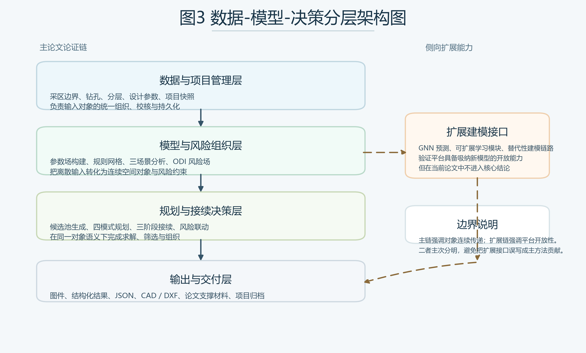

图2表明，平台价值主要体现为跨层数据复用和结果传递能力。正因如此，本文后续的方法描述并不采用“模块说明书”式写法，而是围绕参数场、风险场、候选方案、接续组织和经济评价之间的逻辑耦合关系展开论证。

## 2 关键方法

### 2.1 多源数据标准化与参数场构建

采区规划设计首先面临的难点是输入对象的异构性。采区边界属于几何约束，钻孔数据具有离散采样特征，分层与设计参数则表现为具有工程语义的属性集合。如果缺少统一的数据组织方式，这些对象很难进入同一套规划流程。为此，本文将边界、钻孔、分层与设计参数统一映射为项目上下文中的结构化输入集合 $\mathcal{X}$，并通过项目快照机制保持不同轮次试算之间的状态可追踪性和结果可复用性。该机制保证地质信息、风险参数和规划中间结果能够在同一项目内部持续流动，而不再依赖人工反复导入和手工整理。

需要强调的是，规划求解并不是直接在原始采区边界上进行。实际运行时，系统首先对边界点序列进行闭合和合法性修复；随后结合边界煤柱、隔离煤柱以及保护对象约束，对原始边界进行内缩与裁剪，形成用于候选工作面生成的有效布置域。若内缩后出现多连通域或局部狭长畸变，则保留主连通区域，并在极端情况下采用降级内缩或回退策略保障几何可解性。因此，图3中的外轮廓主要用于定义研究范围和钻孔参照，而真正参与布局求解的是经过边界约束处理后的有效布置域。这一点对于理解采区边界划分、工作面保护距离以及后续方案可实施性具有基础性意义。

在连续参数场构建方面，本文采用以钻孔样点为基础的空间插值策略，将离散样本转换为规划域上的连续参数表达。对给定样点集合 $\{(x_i,y_i,z_i)\}_{i=1}^{n}$，煤层厚度等参数场可表示为

$$
G(x,y)=\frac{\sum_{i=1}^{n} z_i d_i(x,y)^{-p}}{\sum_{i=1}^{n} d_i(x,y)^{-p}} \qquad （1）
$$

式中，$d_i(x,y)$ 为规划位置 $(x,y)$ 与第 $i$ 个钻孔样点之间的距离，$p$ 为距离衰减指数。式（1）表达了反距离加权插值的基本思想，其目的不是追求复杂模型形式，而是为规划决策提供连续、可计算、可传递的地质参数底图[8,16-18]。在采区规划语境中，参数场的意义不在于单独展示地质属性，而在于使地质信息能够实质性进入后续的方案生成与约束筛选过程。

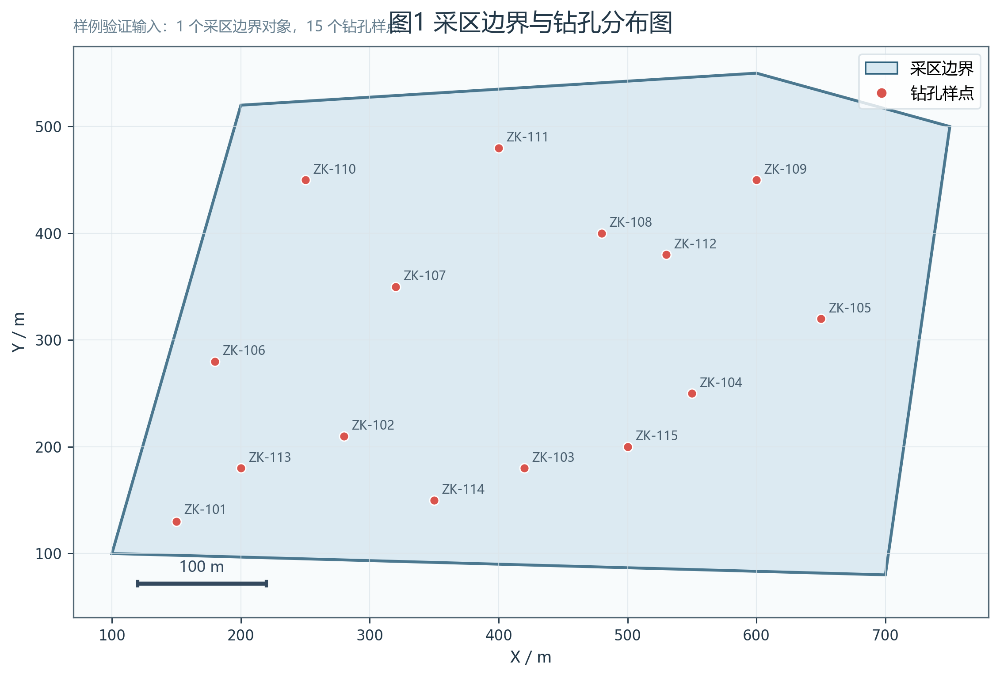

图3给出了样例采区边界及 15 个钻孔样点的空间分布。该图首先确定了研究对象的原始几何边界和采样基础，也为后续参数场构建、风险组织与布局求解提供了统一的空间参照。需要说明的是，图中所示边界是研究范围的外轮廓，而不是工作面可直接布置的最终边界；在进入规划阶段前，系统还需结合边界煤柱、局部保护距离和几何合法性对其进一步处理，形成真正可用于候选布局生成的有效范围。

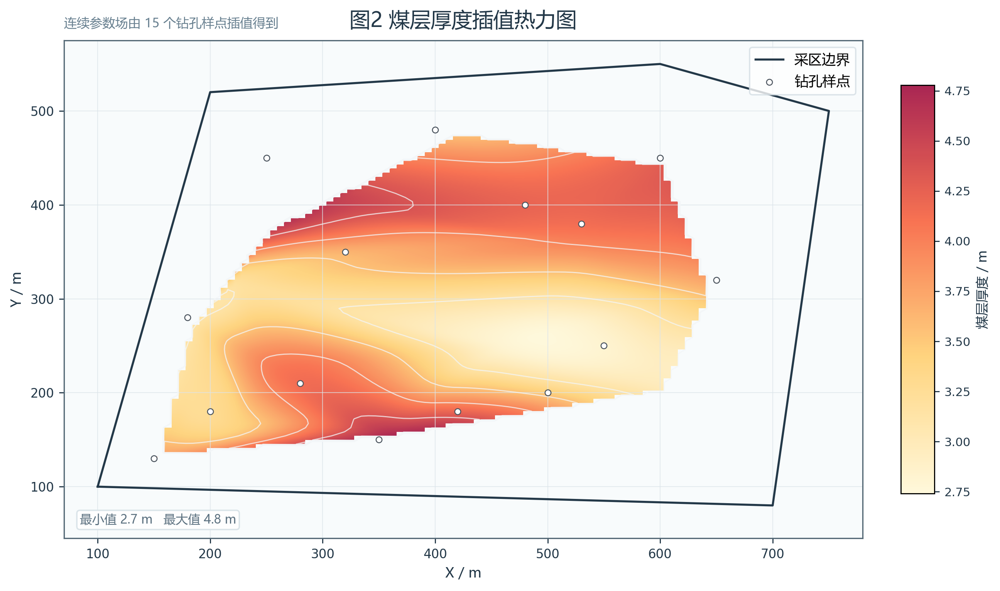

图4表明，离散钻孔厚度信息已经能够被稳定组织为连续参数场，并以等值线和色带形式进入同一张规划底图。样例钻孔厚度最小值为 2.8 m，最大值为 4.8 m，平均值为 3.7933 m；这些样点信息经插值后不再停留于地质展示层，而是直接转化为后续工作面布置、风险筛选和方案比选共享的空间约束基础。换言之，该图支撑的不是“厚度场可视化”这一弱结论，而是“参数场已可被规划链路消费”这一更关键的对象链结论。

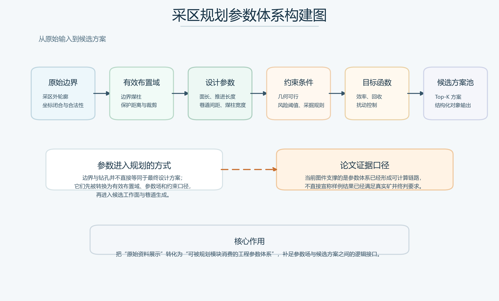

图5进一步概括了参数体系从原始资料到候选方案池的转换关系。采区边界、钻孔和设计参数并不直接等同于最终工程方案，而是需要先经过边界合法性修复、有效布置域构建、约束条件整理和目标函数定义，才能进入候选工作面与巷道生成过程。该图补足了图3和图4之后的关键中间环节，说明本文方法并非仅完成地质参数可视化，而是将原始资料组织为可被规划模块直接消费的工程参数体系。

### 2.2 多场景 ODI 风险表征方法

采区规划中的风险约束并非来源于单一指标，而是表现为地表沉陷、含水层扰动、上行开采等多场景下覆岩扰动的综合影响。若不同风险场景分别以各自判据独立参与规划，容易造成约束尺度不统一、比较依据不一致和中间结果难以复用的问题。为解决这一问题，本文引入 ODI 作为中介变量，将异构风险信息归一到可比较的统一尺度下，以支撑不同场景风险在同一规划框架中的组织、比较与传递。

其基本形式可写为

$$
ODI=w_d I_d+w_o I_o+w_f I_f \qquad （2）
$$

$$
w_d+w_o+w_f=1 \qquad （3）
$$

式中，$I_d$、$I_o$、$I_f$ 分别表示不同风险因子维度上的归一化指标，$w_d$、$w_o$、$w_f$ 为相应权重。式（2）和式（3）的意义不在于给出唯一的行业通用公式，而在于明确一种统一的风险组织思想，即把原本难以直接比较的多场景风险信息转化为可在规划阶段参与约束筛选与方案排序的统一表达。

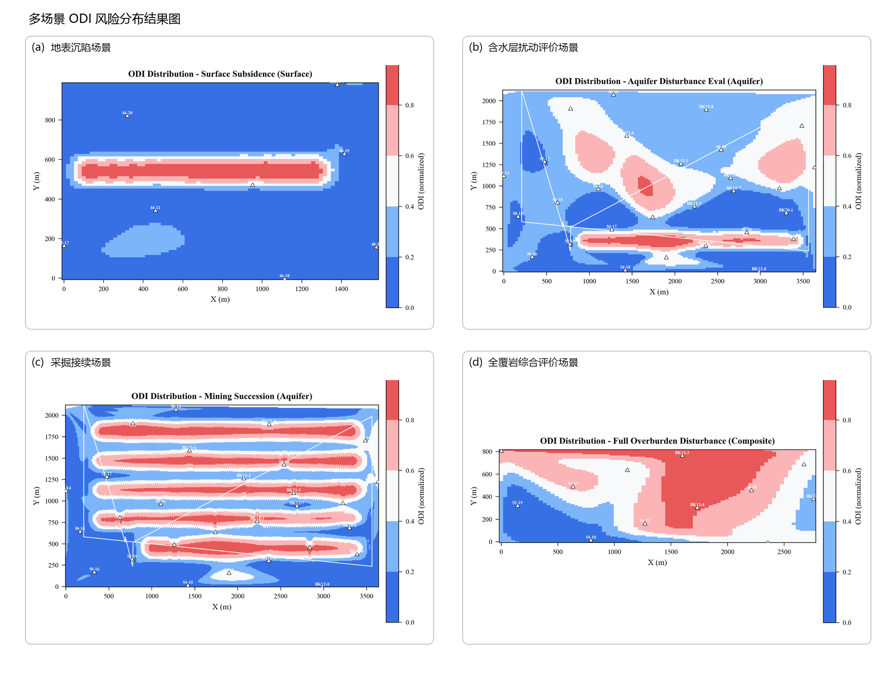

图6给出了由 `export_package` 批量导出的多场景 ODI 风险分布结果。其中，子图 `(a)`、`(b)`、`(c)` 和 `(d)` 分别对应地表沉陷、含水层扰动评价、采掘接续以及全覆岩综合评价场景。与仅给出概念性技术路线相比，这组图更直接地表明本文提出的 ODI 组织框架已经能够在不同业务场景下形成可复核的空间风险结果，并保持统一的颜色标度、钻孔参照和结果表达口径。需要说明的是，批量导出包中同时还包含 `ODI直方图`、`ODI等级饼图`、`参数散点矩阵` 和结果摘要 JSON 等图件与结构化文件；本文主文仅保留最能支撑论证主线的热力图结果，用于说明 ODI 已从方法定义阶段进入可计算、可导出、可比较的样例验证阶段。

**表2 多场景 ODI 风险组织关系**  
**Table 2 Multi-scenario ODI organization relationship**

| 场景 | 主要关注对象 | 输入依据 | ODI 在规划中的作用 |
|---|---|---|---|
| 地表沉陷 | 地表移动与沉陷风险 | 沉陷预测与空间约束[8,24,25] | 约束工作面布局范围与强度 |
| 含水层扰动 | 导水裂隙带与含水层受扰 | 裂隙演化与导水带高度[5,22,23] | 参与风险场筛选与方案排序 |
| 上行开采 | 上覆岩层扰动与安全边界 | 采动应力与覆岩破坏特征[4,7,10] | 作为接续与可行性评价输入 |

因此，ODI 在本文方法中不是附加性的展示指标，而是风险场进入规划、接续与经济评价链路的统一接口。通过这一设计，风险约束得以前置进入方案生成过程，而不是停留在布局完成后的事后解释。

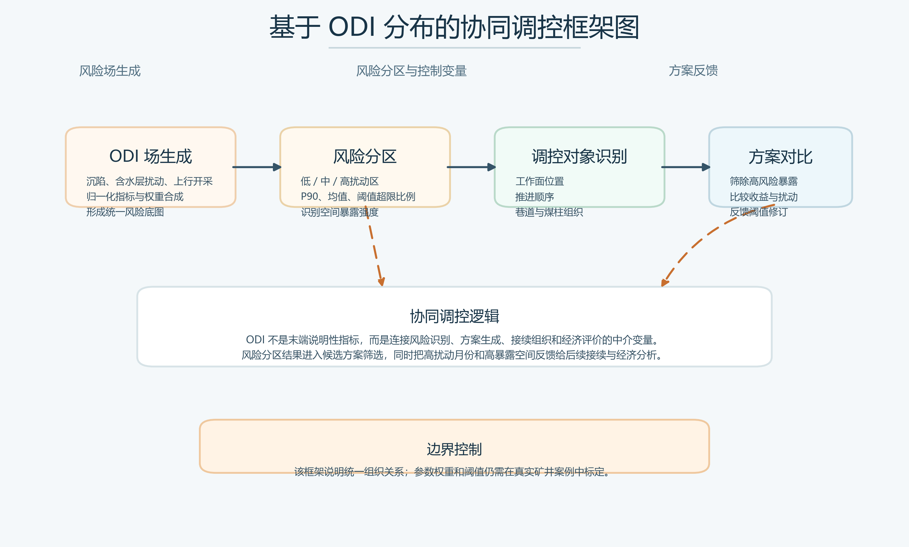

图7说明了 ODI 风险场进入规划调控的具体路径。首先，不同风险因子被组织为统一 ODI 场；其次，系统依据均值、分位数和阈值超限比例等统计量识别低、中、高扰动区；随后，高扰动空间被映射为工作面位置、推进顺序、巷道组织和煤柱边界等调控对象；最后，风险分区结果参与候选方案筛选，并把高扰动月份和高暴露空间反馈至接续与经济评价环节。因此，ODI 在本文中不是单独的展示指标，而是贯穿风险识别、方案生成和后续评价的协同调控接口。

### 2.3 四模式候选规划与方案比选

采区规划设计需要在工程效率、资源回收和扰动控制之间进行权衡。仅输出单一方案往往难以覆盖实际决策中的多目标偏好，也不利于后续人工复核与工程调整。基于此，本文将候选方案组织为工程效率优先、资源回收优先、覆岩扰动优先和综合权衡优化 4 种规划模式。四种模式并非 4 套彼此独立的算法，而是面向同一候选方案池的不同筛选视角。

对候选方案 $\pi \in \Pi$，其综合目标可概括为

$$
\max_{\pi \in \Pi} J(\pi)=w_e S_e(\pi)+w_r S_r(\pi)+w_m S_m(\pi) \qquad （4）
$$

式中，$\Pi$ 为候选规划方案集合，$S_e(\pi)$、$S_r(\pi)$、$S_m(\pi)$ 分别表示方案在工程效率、资源回收和扰动控制方面的评价值，$w_e$、$w_r$、$w_m$ 为权重。当某一风险场在特定工况下不可用时，相应权重可以退化并重新归一，从而保持多模式方案比较的一致性。该目标表达强调的是“同一方案池上的多视角决策”，而非单一算法在抽象数学意义上的最优求解。

四种模式的差别主要体现在评价口径，而不是几何候选生成框架完全彼此独立。工程效率优先模式以有效布置域覆盖率、工作面连续性、巷道组织便利性和工程实施稳定性为核心，更强调在规程允许范围内快速形成高可实施性的布局结果；资源回收优先模式在覆盖率基础上进一步引入厚度场与可采吨位估计，使高厚度区和高资源价值区在排序中获得更高权重；覆岩扰动优先模式则把候选区域内 ODI 均值、P90 及阈值超标比例等统计量作为主要依据，以“低扰动暴露”优先对候选方案进行筛选；综合权衡模式将工程效率、资源回收和扰动控制 3 类目标统一到同一候选池中，通过非支配排序与权重合成完成方案比较。由此，系统既能给出单目标偏好下的解释性方案，也能支持多目标折中条件下的工程决策。

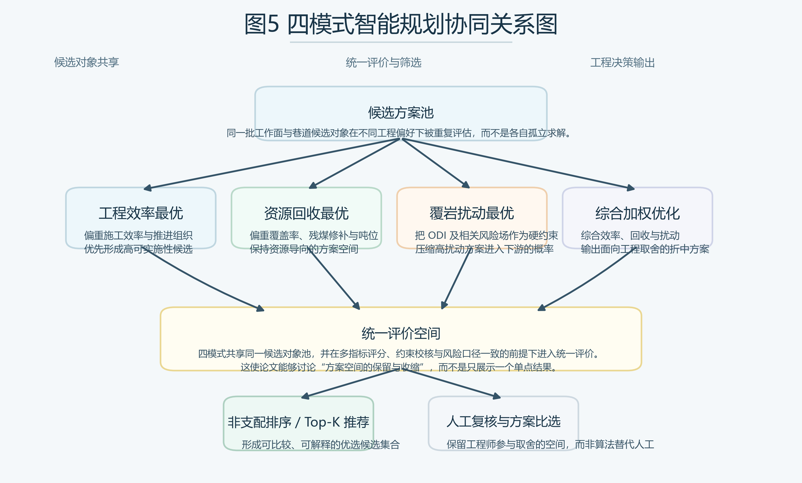

图8展示了候选池生成、多目标评分和四模式筛选之间的协同关系。与传统“只输出一个结果方案”的方式相比，这种组织方式更符合采区规划中“多方案并行比较、人工与算法协同决策”的工程实际[11-15]，也为后续接续评价和经济比较保留了更充分的方案空间。

### 2.4 三阶段采掘接续与经济闭环评价

在一体化方法中，规划结果并不止于工作面和巷道的几何布局，而需要继续进入接续组织与经济评价过程。为此，本文构建三阶段接续与经济闭环：阶段 1 完成几何布局对象向生产组织对象的映射；阶段 2 将 ODI 风险场转化为时间序列上的风险输入；阶段 3 围绕产量、风险和工期形成候选接续方案并开展经济评价。接续综合评分可表示为

$$
S_{succ}=\alpha P+\beta(1-R)+\gamma C \qquad （5）
$$

式中，$P$ 为产量相关指标，$R$ 为风险强度或风险峰值，$C$ 为工期与组织可控性，$\alpha$、$\beta$、$\gamma$ 为权重。该表达说明，接续评价不再是脱离规划结果的独立后处理，而是在同一对象体系上对产量、风险和工期进行再平衡。

进一步地，经济评价通过月度净现金流和净现值指标实现：

$$
NCF_t=Rev_t-Cost_t-RiskCost_t \qquad （6）
$$

$$
NPV=\sum_{t=1}^{T}\frac{NCF_t}{(1+r_m)^t}-I_0 \qquad （7）
$$

式中，$NCF_t$ 为第 $t$ 月净现金流，$Rev_t$ 为收入，$Cost_t$ 为成本，$RiskCost_t$ 为风险联动成本，$I_0$ 为初始投入，$r_m$ 为月折现率。式（6）和式（7）所表达的重点，并非给出完整的财务会计细则，而是说明规划结果、风险约束与经济指标能够在统一链路内闭环耦合[19-21]。

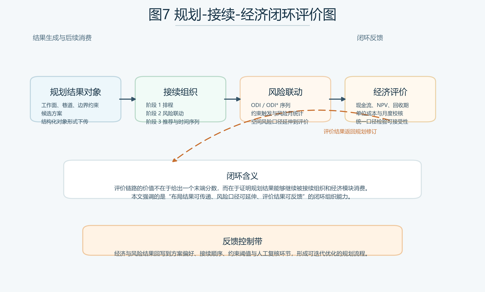

图9表明，本文方法并未把几何布局视为终点，而是把规划结果继续组织为接续分析和经济评价可直接调用的上游对象。由此，传统上后置的风险校核与经济比较被提前纳入同一条规划闭环之中，评价结果也能够反向作用于方案修订，而不再只是末端解释性结论。

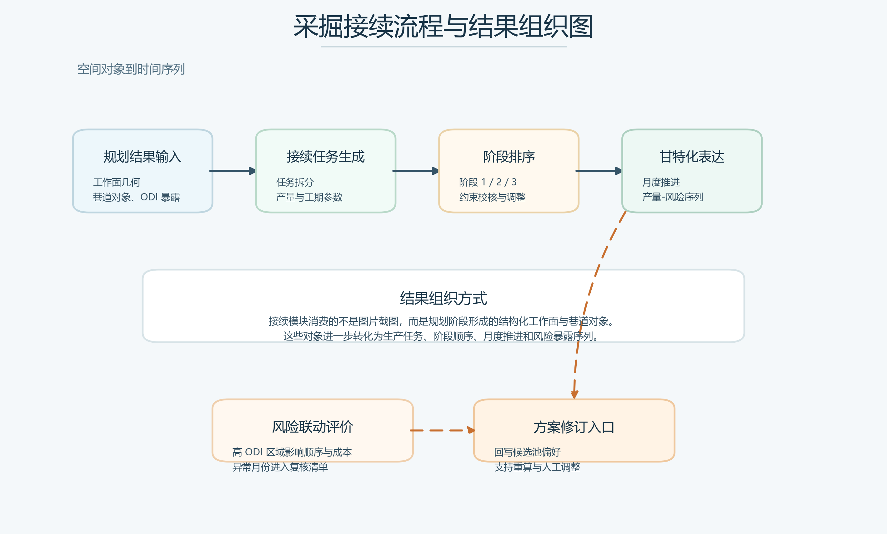

图10进一步展开了规划结果进入采掘接续模块后的对象转换过程。规划阶段输出的工作面几何、巷道对象和 ODI 暴露信息被组织为接续任务，随后形成阶段排序、月度推进、产量序列和风险暴露序列。该流程说明，接续分析消费的并不是静态图片或人工记录，而是规划阶段生成的结构化对象；因此，后续风险联动评价和方案修订能够建立在同一批上游对象之上。

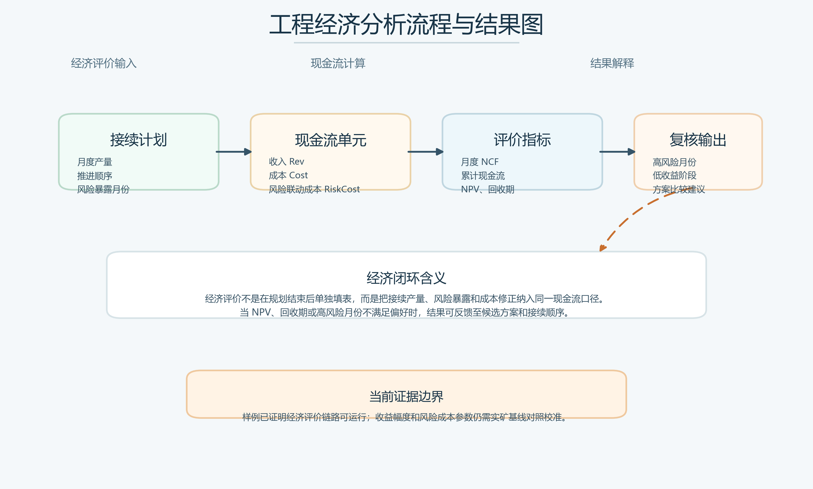

图11给出了经济评价链路的输入、计算和结果解释关系。接续计划提供月度产量、推进顺序和风险暴露月份，经济模块据此计算收入、成本和风险联动成本，并形成月度净现金流、累计现金流、净现值和回收期等指标。当高风险月份、低收益阶段或方案收益差异较为突出时，评价结果可反馈至候选方案偏好和接续顺序调整。该图的作用在于说明经济评价已经嵌入一体化链路，而不是作为规划完成后的孤立附表。

### 2.5 证据映射与复现约束

本文主文证据来自固定样例输入、版本化代码快照和脚本可再生图件，而非脱离运行结果的事后归纳。样例输入主要包括采区边界、钻孔数据和设计参数；中间与输出证据包括地质建模结果、采区设计结果、`data/export_package` 中批量导出的多场景 ODI 图件与摘要文件，以及 GNN 训练输出和网格预测结果。文字整理与图件重构均基于代码快照 `b0d24be` 完成，其中主文机制图由脚本重新生成，主文结果图对应系统接口的实际输出。

需要说明的是，当前工作区已经具备“同版本代码 + 同批样例数据 + 同套脚本”条件下的复现能力，但尚未形成对外发布所需的标准化数据包、参数锁定文件和跨环境复现说明。因此，本文关于方法有效性的表述仅限于样例条件下的再现与链路论证，不扩展为跨矿区、跨环境意义上的充分复现实证。

## 3 结果与验证

### 3.1 样例数据与验证口径

鉴于当前阶段尚缺乏真实矿井多案例对照数据，本文将验证目标限定为样例条件下的方法贯通，而非工业级性能优劣判定。样例输入包括 1 个由 6 个边界点构成的采区边界对象和 15 个钻孔样点，钻孔编号为 ZK-101 至 ZK-115；煤层厚度样本最小值为 2.8 m，最大值为 4.8 m，平均值为 3.7933 m。在此基础上，验证重点集中于 4 个方面：数据能否稳定导入并生成连续参数场，规划模块能否输出结构化工作面与巷道对象，规划结果能否继续进入接续、经济与导出链路，以及扩展建模模块是否具备可运行接口能力。

与常见的算法性能比较研究不同，本文尚未引入真实矿井基线方案对照，也未形成训练/测试切分条件下的统计显著性检验、置信区间或效应量报告。因此，文中的“验证”主要指方法链和对象链在样例数据条件下的贯通性检验，而非基于大样本实验的优越性证明。

**表3 样例贯通验证关键结果**  
**Table 3 Key results of sample end-to-end verification**

| 验证项 | 样例结果 | 解释口径 |
|---|---|---|
| 钻孔样点数量 | 15 个 | 支撑样例级参数场构建 |
| 煤层厚度范围 | 2.8 m 至 4.8 m | 支撑厚度场插值 |
| 工作面数量 | 3 个 | 说明规划可输出结构化对象 |
| 巷道数量 | 11 条 | 说明几何布局链路已贯通 |
| GNN 指标 | MAE=0.5141，RMSE=0.6157，R²=-0.0436 | 仅证明扩展接口可运行 |
| 导出能力 | 图件、JSON、CAD 路径已接通 | 说明成果可继续消费 |

### 3.2 参数场与空间布局结果

完成边界、钻孔与参数输入后，系统首先生成煤层厚度参数场，并在此基础上开展工作面与巷道布局。结合图4与接口结果可见，当前样例条件下系统生成了 3 个工作面和 11 条巷道，这说明参数场已经从“静态地质结果”转化为“可被规划模块消费的约束与评价基础”。从方法链角度看，这一结果表明一体化框架已经能够把输入数据、中间建模结果和规划输出对象稳定衔接起来，而不是依赖人工在不同模块之间重复整理和转换信息。

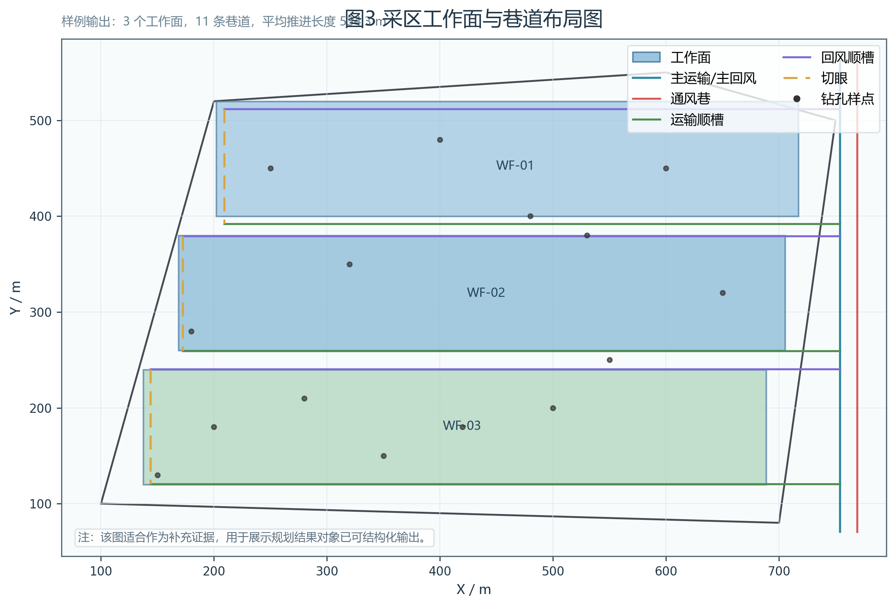

图12给出了原始边界约束下经几何修复、边界内缩、条带切割和巷道生成后形成的布局结果。图中 3 个工作面与配套巷道并不是直接贴附在图3的外边界上，而是在有效布置域内形成必要的保护距离和工程边界。这一结果说明，采区边界划分在规划语境中不能简单理解为“外轮廓包络”，而应理解为“原始边界经边界煤柱、保护条件和几何合法性处理后的可布置范围”。从论文论证角度看，这张图补足了从原始空间输入到结构化布局输出之间的中间环节，也更直接地说明了规划模块如何把边界、钻孔和参数场转化为可消费的几何对象。

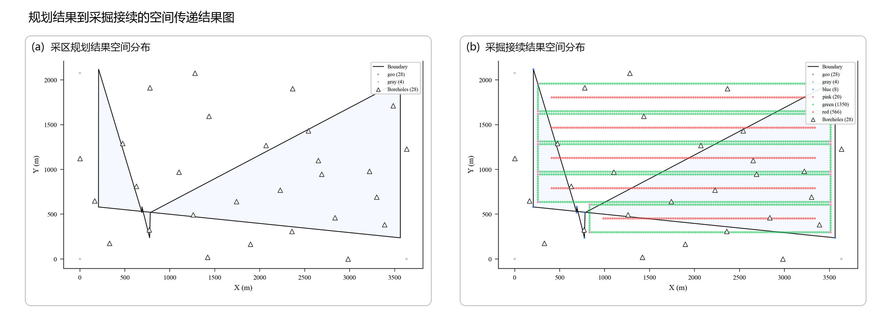

图13给出了由 `export_package` 中采区规划案例和采掘接续案例拼接形成的组合式结果图。其中，子图 `(a)` 展示采区规划阶段的空间分布结果，说明在完成边界、钻孔与参数场构建后，规划模块已经能够形成统一边界约束下的候选空间对象；子图 `(b)` 则展示采掘接续阶段的空间分布结果，说明同一批规划对象可以继续进入接续组织环节，并以规则化工作面条带的形式输出。与单纯界面截图相比，这张组合图更直接支撑本文“对象可传递、链路可贯通”的核心论点，即规划阶段形成的空间结果并不是终点，而是后续接续分析与经济评价的上游输入。需要同时说明的是，当前接续结果仍属于样例级输出，接口校核中的约束提示尚未完全消除，因此这里更适合作为链路贯通证据，而非真实矿井条件下的最终工程定案。

### 3.3 端到端链路贯通结果

从端到端组织角度看，现有样例已经完成了“采区边界与钻孔导入-参数场构建-ODI 风险组织-候选布局求解-接续与经济分析-成果导出”的连续运行过程。该结果的意义不在于单独证明某一算法模块的局部效果，而在于说明各阶段中间对象已经能够在统一数据语义下被后续环节直接调用。换言之，边界、多源钻孔属性、连续参数场、风险约束、工作面几何对象以及接续分析结果之间已经形成可传递、可复核、可继续计算的对象链，而非停留在模块内部的孤立输出。

这一点对于采区规划研究尤为重要。传统流程往往将“数据整理、布局求解、风险校核、接续分析”拆分为多个相对独立的工作包，中间结果需要依赖人工转抄、二次建模或经验解释才能进入下一阶段，因此既增加了重复劳动，也削弱了方案比选的一致性。本文样例验证表明，一体化方法能够将上述中间对象保持在同一套空间参照、参数口径和结构化表达体系之中，从而使规划结果既是当前求解阶段的输出，又是后续接续组织和经济评价的输入。

需要进一步强调的是，本文在证据强度上有意区分“链路贯通”与“工程终判”两类结论。当前样例足以支持前者，即所提方法已经具备连续运行和对象传递能力；但尚不足以支持“所得方案已构成真实矿井条件下的最优或最终可实施方案”这一更强结论。这种口径控制有助于使论文结论与现有证据保持一致，也为后续引入敏东矿实证对照研究预留了清晰的扩展空间。

### 3.4 扩展建模能力与边界说明

除主链路外，系统还提供基于 GNN 的扩展建模接口，用于探索小样本条件下的结构化地质预测。样例运行结果如图14所示。

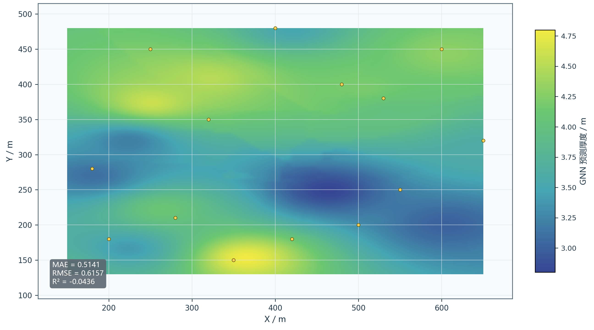

图14表明扩展建模链路已经具备从样本装载、模型训练到空间网格输出的完整技术接口。图中给出的 `MAE=0.5141`、`RMSE=0.6157` 和 `R²=-0.0436` 等指标，更适合被理解为“接口已打通、流程可执行”的技术证据，而非“模型预测性能已经成熟”的学术证据。从系统架构角度看，这一接口的意义在于验证平台并非封闭的单任务工具，而是可以继续吸纳数据驱动模型的开放式框架。

但从学术证据角度看，当前 GNN 模块仍应被审慎界定为“扩展能力展示”而非“核心贡献”。原因在于，现阶段训练样本仅为 15 个钻孔，上述指标尚不足以支持关于泛化精度、工程可用性或相对优越性的强结论。基于这一判断，本文将其置于扩展建模与边界说明部分，而未将其纳入摘要、核心创新点或结论主体，以避免扩展展示对主方法证据链造成干扰。

## 4 讨论

### 4.1 一体化方法相对于传统割裂流程的价值

本文方法的核心价值，不在于单点提出一种替代现有地质建模、规划求解或经济评价理论的新算法，而在于把原本分散在多个工作环节中的输入、约束、求解和评价过程组织为可连续传递的方法链。相较于传统“先布局、后校核、再补评价”的割裂流程，本文强调在规划早期即同步组织地质参数场、风险约束和后续评价需求，从而减少由环节割裂带来的信息损耗和人工重构。

这种一体化组织至少体现为三方面价值。第一，规划输入、中间模型结果和输出对象被纳入统一数据上下文，降低了重复整理、口径不一致和人工转译的代价。第二，ODI 风险组织不再只是布局完成后的解释性附注，而是以前置约束和评价依据的形式参与候选方案生成与筛选，使风险分析真正进入方案形成阶段。第三，布局结果能够继续传递到接续与经济分析模块，使方案生成、复核和比较建立在同一对象体系之上，更接近真实工程决策所要求的连续工作流。

需要指出的是，本文所强调的优势首先是一种方法组织层面的改进，而不是对某一成熟优化算法性能的直接超越。因此，当前稿件更适合被界定为方法论验证稿：其主要贡献在于建立统一链路、明确对象关系并完成样例条件下的端到端证据闭环。至于相对于传统流程究竟能够带来多大幅度的工程收益，仍需通过敏东矿等真实案例的对照实验进一步量化。

### 4.2 当前局限性与投稿边界

需要明确的是，当前稿件虽然已经形成较完整的方法论证和图表体系，但仍存在清晰且必须正面说明的投稿边界。首先，现有验证证据主要来源于样例数据、已有程序输出以及针对接口链路的复核结果，尚未形成“真实矿井案例-传统基线方案-一体化方法方案”的成组对照证据，因此本文当前更适合论证方法可行性与链路有效性，而不宜直接外推为普适工程优越性。其次，ODI 在不同地质条件、风险偏好和约束场景下的参数标定尚未系统展开，因此更适合被界定为统一风险组织框架，而非已完成广泛工程标定的标准化行业模型。

再次，从当前规划结果本身看，虽然系统已生成 3 个工作面和 11 条巷道，并完成了布局对象、结构化文件和可视化图件的同步输出，但接口校核仍给出了“推进长度小于最小值 800.0 m”的提示。这说明现阶段结果已经足以作为候选设计对象、链路贯通证据和后续对照实验底稿，却尚未达到可直接作为真实生产方案提交终判的约束满足水平。正文对这一点作出明确说明，并不会削弱论文可信度，反而有助于把方法稿与工程终判稿严格区分。

最后，稿件仍有少量投稿层面的收口工作尚未完成，主要包括敏东矿实证材料的进一步补充、目标期刊首页脚注规则核定、收稿与修回日期是否留空的模板确认，以及英文二级单位是否需按学校官网正式译名微调。因此，就当前状态而言，本文已经基本具备方法稿主体形态，但距离“实矿对照证据充分、模板细节完全匹配、可直接送审的终稿”仍存在明确的增强阶段。

### 4.3 后续深化方向

为进一步达到正式投稿要求，后续工作宜从三个方向推进。第一，以敏东矿为优先实证对象，引入真实矿井案例和传统规划流程基线方案，建立“传统流程-一体化方法”的对照证据，并报告可比较的工程指标。第二，围绕 ODI 多场景参数开展标定与敏感性分析，补充不确定性与统计检验信息，增强方法的可解释性和可复现性。第三，继续核定目标期刊模板细节、英文单位正式译名和图件分辨率要求，使稿件由“方法链可证明”进一步推进到“案例证据可支撑、模板要素可核验”的正式投稿状态。

## 5 结论

1. 针对采区规划设计中数据组织、风险约束、方案生成、采掘接续与经济评价相互割裂的问题，构建了覆盖参数场、风险场、候选规划、接续组织和经济评价的一体化方法链，实现了规划对象在“数据-模型-规划-评价-导出”各环节之间的连续组织与传递。
2. 通过引入多场景 ODI 统一风险表达，将地表沉陷、含水层扰动和上行开采等异构风险纳入同一约束框架，使风险分析能够以前置方式进入候选方案生成、筛选和后续接续评价过程。
3. 样例验证表明，系统能够以 15 个钻孔样点为输入，输出 3 个工作面、11 条巷道以及多类关键图件和结构化结果文件，说明所提方法已具备连续运行与对象传递能力；但当前证据仍主要停留在样例论证层面，真实矿井条件下的优选结论仍需结合实矿案例、参数标定和基线对照进一步检验。

## 参考文献
[1] WU Xuefei, LI Hongxia, WANG Baoli, et al. Review on improvements to the safety level of coal mines by applying intelligent coal mining[J]. Sustainability, 2022, 14(24): 16400. DOI: 10.3390/su142416400.
[2] WANG Guofa, REN Huaiwei, ZHAO Guorui, et al. Research and practice of intelligent coal mine technology systems in China[J]. International Journal of Coal Science & Technology, 2022, 9(1). DOI: 10.1007/s40789-022-00491-3.
[3] ZHANG Kexue, KANG Lei, CHEN Xuexi, et al. A review of intelligent unmanned mining current situation and development trend[J]. Energies, 2022, 15(2): 513. DOI: 10.3390/en15020513.
[4] YANG Yi, LI Yingchun, WANG Lujun, et al. On strata damage and stress disturbance induced by coal mining based on physical similarity simulation experiments[J]. Scientific Reports, 2023, 13(1). DOI: 10.1038/s41598-023-42148-4.
[5] REN Yiwei, YUAN Qiang, CHEN Jie, et al. Evolution characteristics of mining-induced fractures in overburden strata under close-multi coal seams mining based on optical fiber monitoring[J]. Engineering Geology, 2024, 343: 107802. DOI: 10.1016/j.enggeo.2024.107802.
[6] YANG Xiao, SHI Longqing, QIU Mei, et al. Spatiotemporal evolution patterns of mining-induced overburden damage based on microseismic event response analysis[J]. Journal of Applied Geophysics, 2025, 242: 105876. DOI: 10.1016/j.jappgeo.2025.105876.
[7] ZHANG Jie, WANG Li, YANG Tao, et al. Study on overburden failure characteristics and ground pressure behavior in shallow coal seam mining underneath the gully[J]. Frontiers in Earth Science, 2024, 12. DOI: 10.3389/feart.2024.1375979.
[8] CAO Jian, HUANG Qingxiang, GUO Lingfei. Subsidence prediction of overburden strata and ground surface in shallow coal seam mining[J]. Scientific Reports, 2021, 11(1). DOI: 10.1038/s41598-021-98520-9.
[9] PRAKASH Amar, BHARTI Abhay Kumar, VERMA Aniket. Unearthing underground mining-induced strata disturbance by electrical resistivity tomography interpretation[J]. Environmental & Engineering Geoscience, 2022, 28(4): 361-369. DOI: 10.2113/eeg-d-21-00073.
[10] SHI Xiuchang, ZHANG Jixing. Characteristics of overburden failure and fracture evolution in shallow buried working face with large mining height[J]. Sustainability, 2021, 13(24): 13775. DOI: 10.3390/su132413775.
[11] FOROUGHI Sorayya, HAMIDI Jafar Khademi, MONJEZI Masoud, et al. The integrated optimization of underground stope layout designing and production scheduling incorporating a non-dominated sorting genetic algorithm (NSGA-II)[J]. Resources Policy, 2019, 63: 101408. DOI: 10.1016/j.resourpol.2019.101408.
[12] SHAN Yang, KE Li, XIANG Jun, et al. Multi-objective optimisation based on NSGA-II of mine cut-off grade from the perspective of resource security[J]. International Journal of Mining, Reclamation and Environment, 2025: 1-20. DOI: 10.1080/17480930.2025.2532460.
[13] GU Xiaowei, WANG Xunhong, LIU Zaobao, et al. A multi-objective optimization model using improved NSGA-II for optimizing metal mines production process[J]. IEEE Access, 2020, 8: 28847-28858. DOI: 10.1109/access.2020.2972018.
[14] NESBITT Peter, BLAKE Lewis R., LAMAS Patricio, et al. Underground mine scheduling under uncertainty[J]. European Journal of Operational Research, 2021, 294(1): 340-352. DOI: 10.1016/j.ejor.2021.01.011.
[15] PATHIRANAGE Ishara Hewa, NEUMANN Aneta. Multi-objective evolutionary optimization for large-scale open pit mine scheduling[C]//2024 IEEE Congress on Evolutionary Computation (CEC). 2024: 1-8. DOI: 10.1109/CEC60901.2024.10612008.
[16] ZHANG Xuhui, LV Xinyuan, WANG Yan, et al. Production process management for intelligent coal mining based on digital twin[M]//Digital Twin Driven Service. 2022: 251-277. DOI: 10.1016/B978-0-323-91300-3.00008-5.
[17] QU Juncong, KIZIL Mehmet S., YAHYAEI Mohsen, et al. Digital twins in the minerals industry: a comprehensive review[J]. Mining Technology, 2023, 132(4): 267-289. DOI: 10.1080/25726668.2023.2257479.
[18] PAN Dongdong, XU Zhenhao, LU Xinming, et al. 3D scene and geological modeling using integrated multi-source spatial data: methodology, challenges, and suggestions[J]. Tunnelling and Underground Space Technology, 2020, 100: 103393. DOI: 10.1016/j.tust.2020.103393.
[19] AHMED Haitham M., ADEWUYI Sefiu, AHMED Hussin M. A. Continuous cash flow modeling for economic evaluation and risk analysis in mine planning using Monte Carlo simulation[J]. Journal of King Abdulaziz University: Engineering Sciences, 2024, 34(2). DOI: 10.4197/eng.34-2.6.
[20] LI Jiaoqun, WU Tong, LU Zengxiang, et al. Investigation into mining economic evaluation approaches based on the Rosenblueth point estimate method[J]. Applied Sciences, 2023, 13(15): 9011. DOI: 10.3390/app13159011.
[21] DEHGHANI Hesam, ATAEE-POUR Majid, ESFAHANIPOUR Akbar. Evaluation of the mining projects under economic uncertainties using multidimensional binomial tree[J]. Resources Policy, 2014, 39: 124-133. DOI: 10.1016/j.resourpol.2014.01.003.
[22] LIU Xiong, ZHENG Lulin, LIU Hao, et al. Evolution of overburden fractures and the water-conducting fracture zone in closely spaced coal mine seams under highly water-rich aquifers[J]. ACS Omega, 2025. DOI: 10.1021/acsomega.5c09774.
[23] XUE Sen, WANG Qiqing, SONG Zhen. Analysis of water-permeable fractured zone in weakly cemented overburden considering rock strain-softening[J]. Scientific Reports, 2026, 16(1). DOI: 10.1038/s41598-026-45413-4.
[24] ZHU Xiaojun, ZHA Feng, GUO Guangli, et al. Mechanical prediction method of strata movement and surface subsidence in backfill-strip mining[J]. Scientific Reports, 2024, 14(1). DOI: 10.1038/s41598-024-82761-5.
[25] KRATZSCH Helmut. Strata movement at the mining horizon[M]//Mining Subsidence Engineering. Berlin, Heidelberg: Springer, 1983: 7-40. DOI: 10.1007/978-3-642-81923-0_2.
